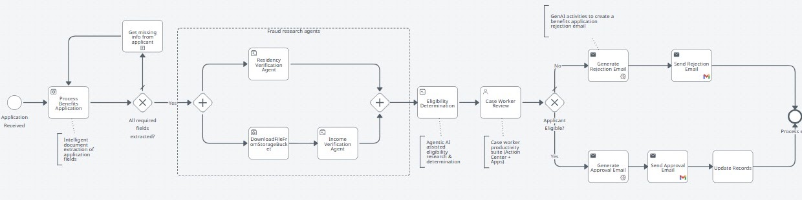

# Automating Business Processes using BPMN canvas

!!! tip "Here is our plan for this lesson:"

    1. Review the Benefit Claims process and its six common steps
    2. Open the BPMN designer and import the Benefit Claims diagram
    3. Analyze the diagram and map each process step onto it

## Goal

Modeling starts with process diagramming and optimization. Before building anything, you'll review
the process you're about to implement and see it drawn as a **BPMN** diagram — the shape the rest of
the exercise fills in.

## Let's draft a simple process

Let's practice agentic automation using a simplified version of the **Benefit Claims** process.

Here are the common steps of the **Benefit Claims** process we are going to implement:

1. **Application Submitted** — Applicant submits a completed benefits application, along with any other required documents, like proof of income, proof of residency, proof of identity, etc.
2. **Application processing** — The benefits application is processed and checked for completeness. If any information is missing, the applicant is contacted.
3. **Fraud checks** — fraud checks are being conducted by AI Agents to verify:
    1. The residency address declared by the applicant corresponds with the address from existing records.
    2. The income amount declared by the applicant corresponds with existing records.
4. **Eligibility determination** — Based on the declared household size and monthly income, the benefit guidelines are checked by an AI Agent to determine whether the applicant qualifies for benefits or not. This is the step where the benefit amount is also being calculated.
5. **Case Worker Review** — The case worker is presented with the complete case information: application information, fraud check results and eligibility determination made by the agents. The worker makes a decision whether to Approve or Deny the benefits claim.
6. **Application Notification** — The applicant is informed about the decision made by the case worker.

## Steps

### 1. Visualize the process in BPMN

Let's visualize this process using BPMN (Business Process Model and Notation):

1. Open the BPMN designer tool: [https://bpmn.uipath.com/](https://bpmn.uipath.com/)
2. Import the **Benefit Claims Diagram**
    - Diagram can be found here: [https://view.highspot.com/viewer/01988c165ebd35be0b21e64eaaa149e5](https://view.highspot.com/viewer/01988c165ebd35be0b21e64eaaa149e5)
    - Passcode:

    ```text
    Shs1*nb2gj3!
    ```

3. Analyze the diagram to understand the process:
    - See if you can identify the Benefit Claims process steps defined above inside the BPMN diagram

!!! info "About the BPMN designer"
    [https://bpmn.uipath.com/](https://bpmn.uipath.com/) is a web-based, beginner-friendly modeler
    tool for designing business processes using Business Process Model and Notation (BPMN) 2.0
    standard symbols. It allows users to create visual flowcharts — including start/end events,
    tasks, and gateways — that can be directly converted into automated workflows within **UiPath
    Maestro**.

### 2. Check your result

This is the kind of workflow you should expect at the end:

{ .screenshot width="900" }

During subsequent lessons we will use this diagram with other components of the UiPath platform to
build an end-to-end agentic automation process.

{ width="420" }
