# Setting up the Solution

!!! tip "Here is our plan for this lesson:"

    1. Create a Maestro Agentic Process Solution in **Studio Web**, starting from a template
    2. Add the necessary solution resources — connections, context grounding indexes, and storage buckets

## Goal

Create the **Benefit Claims Processing** solution from a prepared template, then link the resources
the agentic process needs later: two **Integration Service** connections, three **Context Grounding**
indexes, and two **Orchestrator** storage buckets.

[[[
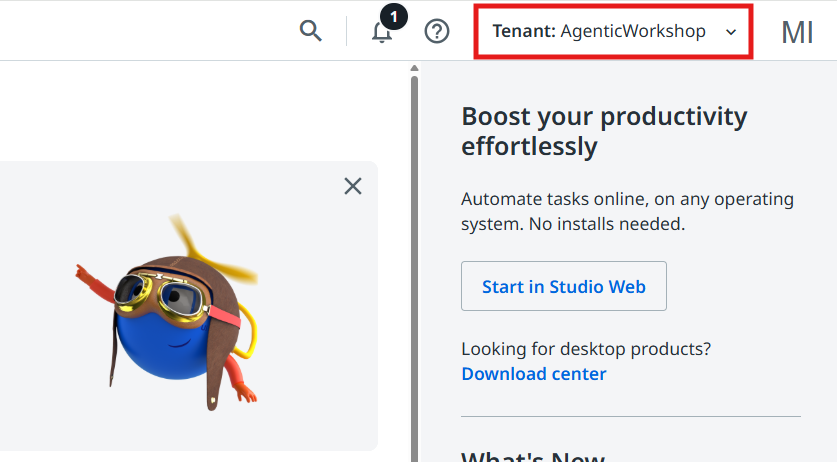{ .screenshot }
|70|
!!! warning "Check your tenant first"
    Make sure the **AgenticWorkshop** tenant is selected from the top right corner.
]]]

## Steps

### 1. Create an Agentic Process solution

Let's start by creating a new Agentic Process from a previously created template.

In the [Studio Web](https://cloud.uipath.com/tpenlabs/studio_/projects) home page go to
**Templates** and select the **Benefit Claims Processing Template**. This will create a new
solution, based on a project that was previously submitted as a template.

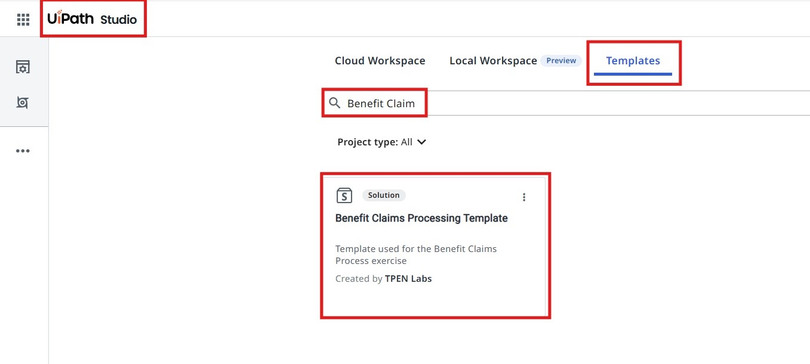{ .screenshot width="900" }

You will notice that this will create a new
[UiPath Solution](https://docs.uipath.com/solutions-management/automation-cloud/latest/user-guide/solutions-management-overview).

A solution bundles together multiple components (processes, assets, queues, etc.) developed on the
UiPath platform that work together to automate a business use case. In the UiPath context, a
solution can be as simple as a Studio workflow/process, or as complex as a combination of multiple
workflows or processes, agents, apps, assets, queues, storage buckets, Data service entities, etc.

Our Benefit Claims solution contains a few components:

- The Agentic Process (Benefit Claims Processing)
- **Process Benefits Application** — an RPA Workflow that uses [UiPath IXP — Unstructured Documents](https://docs.uipath.com/ixp/automation-cloud/latest/user-guide/introduction) to extract data from the Benefits Claim application.
- **Addition Tool**, **Multiplication Tool**, **Subtraction Tool** — a few RPA workflows which will be used as tools by AI Agents
- **DownloadFileFromStorageBucket** and **UploadFileToStorageBucket** — two RPA workflows which will help with handling files from Orchestrator Storage Buckets.
- A UiPath App, used to present claim details and decisions to Case Workers (Action App).

??? note "Learn more about the Unstructured and Complex Documents feature of IXP"

    [The Unstructured and complex documents](https://docs.uipath.com/ixp/automation-cloud/latest/user-guide/introduction)
    capability enhances the capability to handle complex unstructured documents, and uses generative
    AI to map fields and field groups as defined in the extraction schema and predict them with
    confidence and accuracy. This advanced feature is adept at extracting data from intricate
    elements like complex tables, charts, or graphs, and it structures the output effectively.

    The process involves:

    - Reviewing initial model predictions.
    - Modifying prompt instructions iteratively based on review outcomes.
    - Annotating documents to gather ground truth for validation and to inform refining the performance of data extraction.

    Extracting data from unstructured documents, such as contracts, long invoices, or other similar
    documents, requires a systematic and intelligent approach due to the variations in format,
    language, and layout.

### 2. Rename your solution

[[[

|30|
> The art of keeping your projects organized is rooted in habits — and habits are nurtured through
> consistent practice.
>
> — *Generated by a wise ancient LLM*
]]]

So, don't forget to reinforce your good habits and rename our solution:

- right-click on the solution and select **Rename**
- let's give a meaningful name to our solution. We can name it:

```text
Benefit Claims Processing - <Your Name>
```

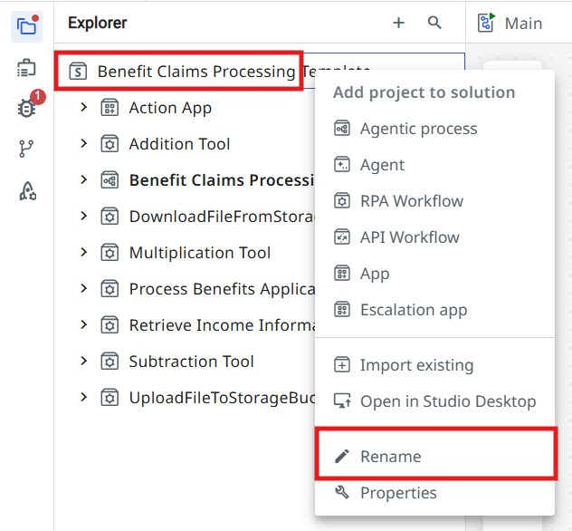{ .screenshot width="700" }

## Adding resources to our solution

Next, let's link a few resources that our agentic process is going to use.

### 3. Configure the Integration Service connections

Let's start with the [Integration Service Connections](https://docs.uipath.com/integration-service/automation-cloud/latest/user-guide/connections).

In a nutshell, Integration Service does the following:

- Enables automation with an out-of-the-box library of connectors.
- Helps setting up and managing connections easily with standardized authentication.
- Enables kicking off automations with server-side triggers or events.
- Provides curated activities and events (with additional data filters) for ease of use.
- Simplifies automation design by providing a uniform experience across all Studio designers.

[[[
We are going to use a few connections throughout our process, so let us go ahead and configure them.

In the bottom-left panel of the solution, expand the **Connections** dropdown.
|30|
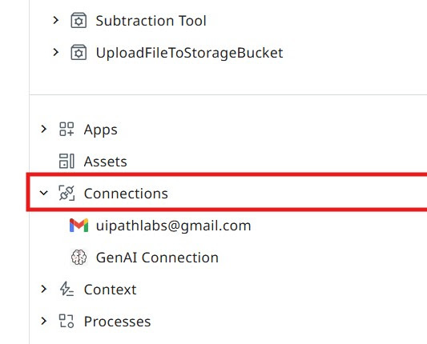{ .screenshot }
]]]

[[[
Configure the **Gmail** connection as in the picture from the right.
|50|
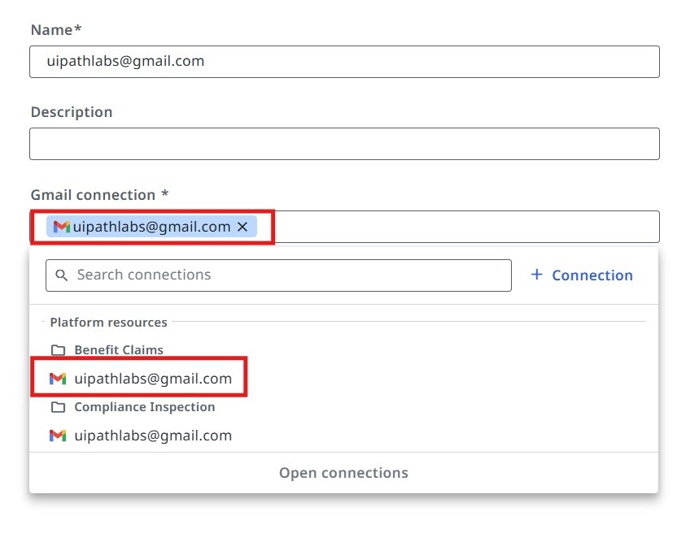{ .screenshot }
]]]

[[[
Configure the **GenAI** connection as in the picture from the right.
|50|
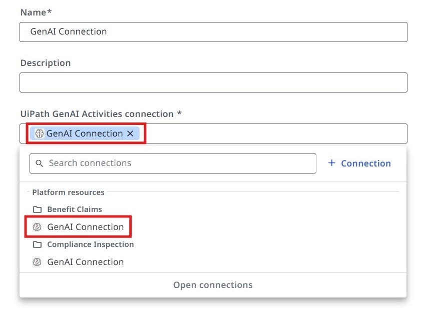{ .screenshot }
]]]

### 4. Add the Context Grounding indexes

In order for our agents to generate meaningful answers and decisions, we need to ground their
knowledge to relevant Benefit Claims regulations and guidelines. To do that, we are going to use
[Context Grounding](https://docs.uipath.com/automation-cloud/automation-cloud/latest/admin-guide/about-context-grounding).

Context Grounding allows you to bring in your data to generate more accurate, reliable GenAI
predictions. You can create representative indexes and embeddings of business data that UiPath GenAI
features can reference for contextual evidence at runtime.

Let's add a few
[Context Grounding Indexes](https://docs.uipath.com/orchestrator/automation-cloud/latest/user-guide/about-indexes)
to our solution, which we are going to use later for our agents.

Configure the **Eligibility** context as in the picture below:

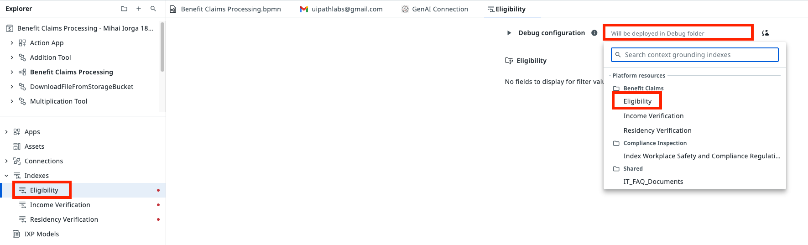{ .screenshot width="900" }

Configure the **Income Verification** context as in the picture below:

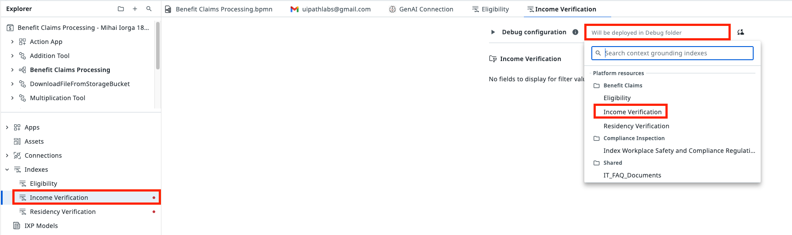{ .screenshot width="900" }

Configure the **Residency Verification** context as in the picture below:

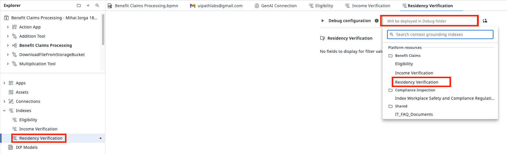{ .screenshot width="900" }

### 5. Connect the Storage Buckets

In our scenario, the process relies on files submitted by the applicants for benefit claims. We will
store these files inside
[Orchestrator Storage Buckets](https://docs.uipath.com/orchestrator/automation-cloud/latest/user-guide/about-storage-buckets).

Let's connect the Storage Buckets to our solution.

Configure the **Eligibility** storage bucket as in the picture below:

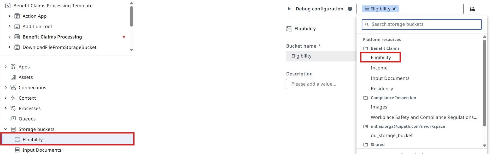{ .screenshot width="900" }

Configure the **Input Documents** storage bucket as in the picture below:

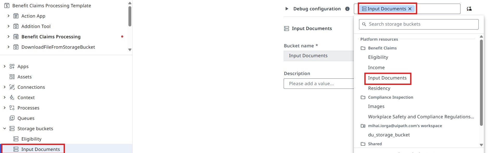{ .screenshot width="900" }

**Time to move to the next one!**
