# Add an RPA automation to your Maestro workflow

!!! tip "Here is our plan for this lesson:"

    1. Trigger an RPA workflow from the Maestro agentic process
    2. Learn how IXP — Unstructured Docs works
    3. Learn how process inputs and outputs work

## Goal

The first step of the agentic process runs as an RPA workflow: it downloads the benefits application
from a storage bucket and uses **IXP** to extract the key data points. You'll wire that workflow into
the Maestro diagram, then configure the gateway that decides whether extraction was complete.

## Automating Tasks using Robots

In our scenario, the agentic process receives as an input a PDF document representing the benefit
claims application. This document is stored inside an
[Orchestrator Storage Bucket](https://docs.uipath.com/orchestrator/automation-cloud/latest/user-guide/about-storage-buckets).

Let's assume that there is an external application from which the applicant uploads the application
and any other supporting documents, and they get stored in the storage buckets. The start point of
our agentic process are the documents from the storage bucket.

The first step in our agentic process is going to be executed using an RPA workflow and does the
following tasks:

- Download the application document from the Storage Bucket
- Uses [IXP — Unstructured Documents](https://docs.uipath.com/ixp/automation-cloud/latest/user-guide/extracting-data-from-unstructured-documents) to extract key data points from the benefits application using Generative AI.

## IXP — Unstructured Docs

UiPath IXP — Unstructured Documents uses Generative Extraction to process complex, unstructured
documents.

This capability is ideal for advanced document processing when:

- documents contain paragraphs of free-form text or complex elements, such as: Complex tables, Graphics, Charts, Checkboxes, Call-out boxes, Signatures, Handwriting etc.
- you need to extract inferred values (information that is not stated directly in the document but must be derived from context)

The general steps of the creation and deployment process within the Unstructured and complex document
capability are the following:

1. **Model building**
    - Upload sample documents
    - Define the document taxonomy — specific data points (fields) and their relationship (field groups) you wish to extract.
    - Build the taxonomy — configure the extraction schema and provide instructions to inform extraction predictions
    - Review LLM predictions — assess the initial predictions to gauge model performance
    - Modify prompts — adjust prompt instructions based on performance reviews and test their impact
    - Validate extractions — confirm or correct extractions to collect accurate ground truth data for further validation
2. **Model validation**
    - Review performance — Review the performance statistics for each model version
    - Compare models — Evaluate different model versions
    - Refine performance
3. **Model deployment**
    - Publish models — once the models achieve the desired performance level, publish and deploy models to make them available for Studio workflows
    - Roll back to a previous model version, if necessary.

## Steps

### 1. Explore the RPA workflow

Our RPA workflow is already part of the solution and is called **Process Benefits Application**. Get
familiar with it by taking a look inside.

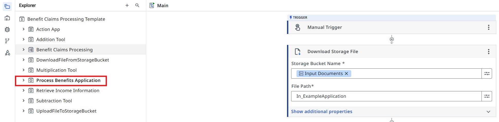{ .screenshot width="900" }

[[[
**Process Benefits Application** inputs and outputs.
|30|
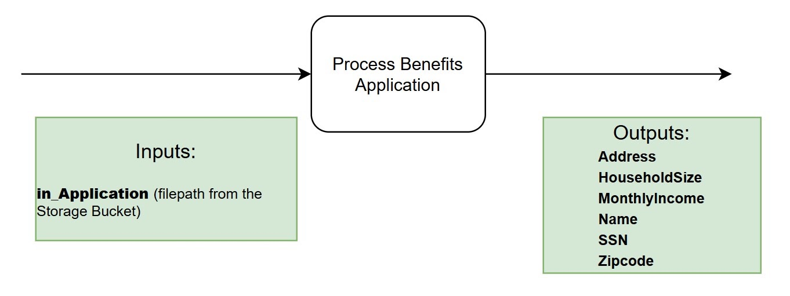{ .screenshot }
]]]

Get familiar with the RPA workflow by giving it a run in debug mode and explore its outputs. You can
use a sample file path like:

```text
Sample application.pdf
```

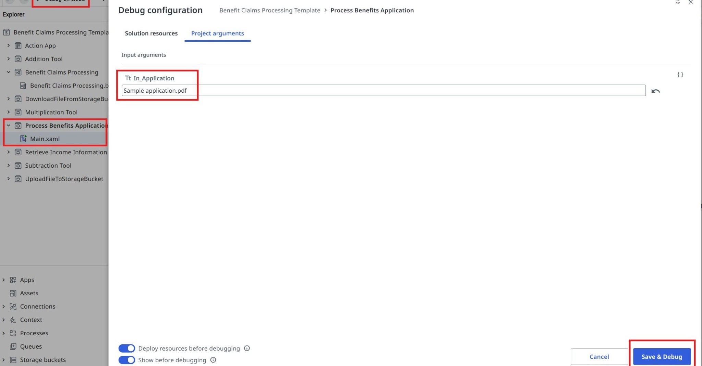{ .screenshot width="900" }

[[[
Have a look at the output panel.
|50|
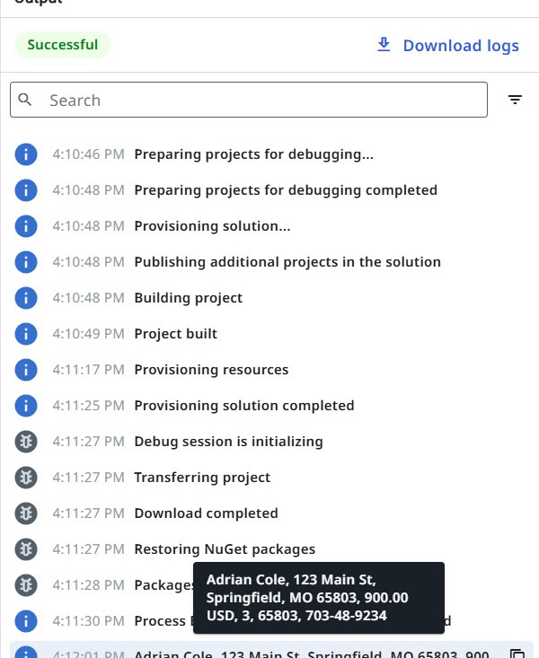{ .screenshot }
]]]

### 2. Trigger the workflow from the agentic process

Once you have validated that the process runs as expected, let's go back to the Agentic Process
diagram and update our task:

- Open the properties panel by clicking on the task
- Pick **Workflows → Start and wait for RPA workflow** as the task's Action type.

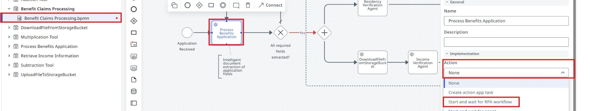{ .screenshot width="900" }

[[[
Find the **Process Benefits Application** RPA workflow and select it.
|50|
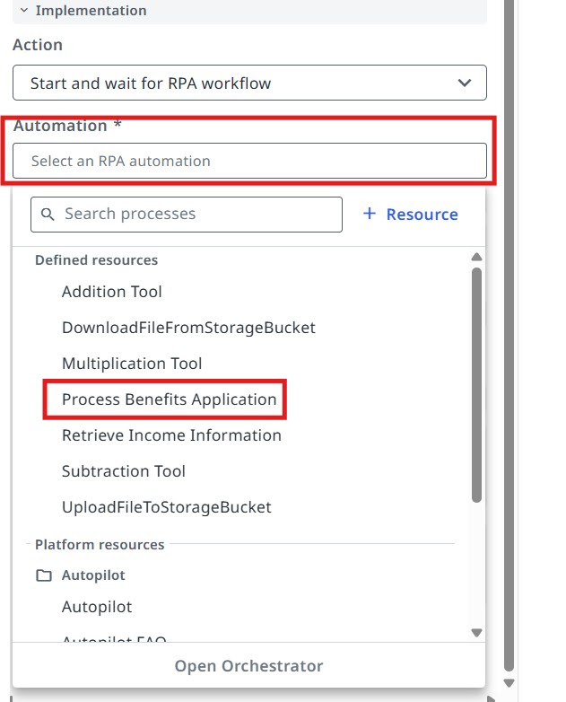{ .screenshot }
]]]

[[[
You will be able to see and configure inputs and outputs right away. We need to pass the
**In_Application** variable as input (this comes as an input argument from the start event of our
agentic process).
|50|
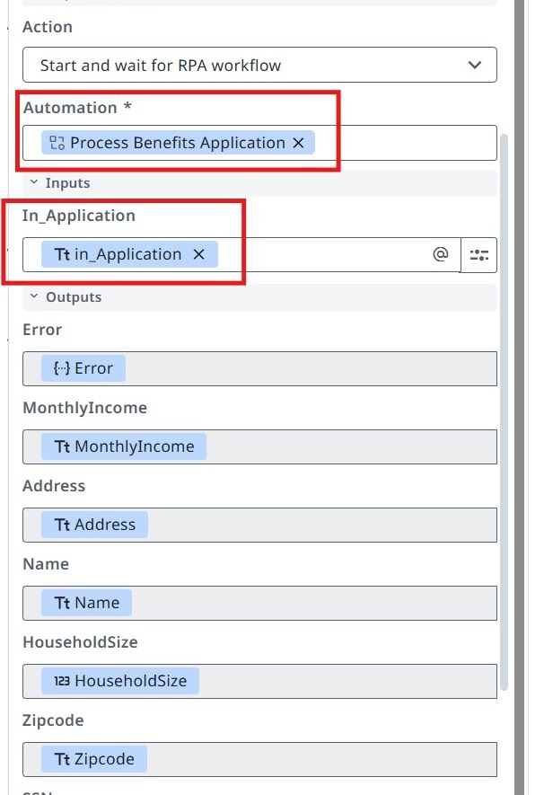{ .screenshot }
]]]

## Configuring the Exclusive Gateway

Based on the outputs of the RPA process (the values extracted from the benefits application
document), we can configure the **All required fields extracted?** exclusive gateway (decision
point).

- If any information is missing, we enter the **Get missing info from applicant** sub-process.
- If all fields are extracted, we move to the next steps — performing fraud checks for residency and income.

### 3. Configure the Yes branch

[[[
Let's configure the **Yes** branch — this should be executed when all fields are extracted.
|30|
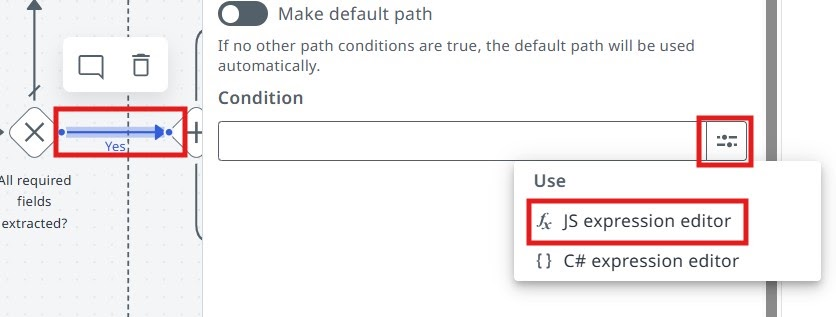{ .screenshot }
]]]

[[[
Click on the **Yes** branch and go to JS expression editor.

Enter the following JS expression:
|50|
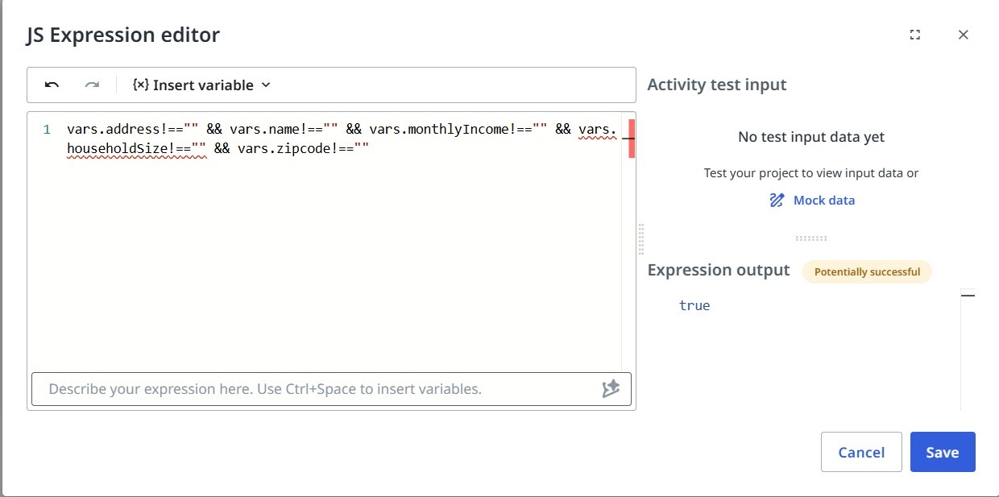{ .screenshot }
]]]

```js
vars.address!=="" && vars.name!=="" && vars.monthlyIncome!=="" && vars.householdSize!=="" && vars.zipcode!=="" && vars.ssn!==""
```

### 4. Make the No branch the default path

[[[
Since there are only two output paths for our exclusive gateway, we can mark the **No** branch as the
default path (if the condition of the **Yes** path will not be met, the **No** path will be taken out
of the gateway).
|30|
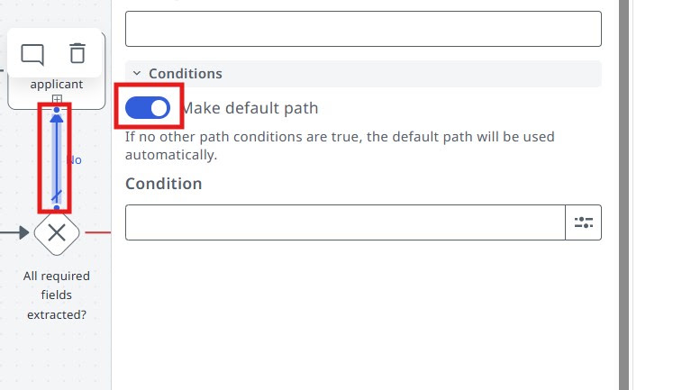{ .screenshot }
]]]

### 5. Run the agentic process

Now let's try launching the Agentic Process from **Studio Web** and have a look at the execution.
Debug the process with this `In_Application` value:

```text
Sample application.pdf
```

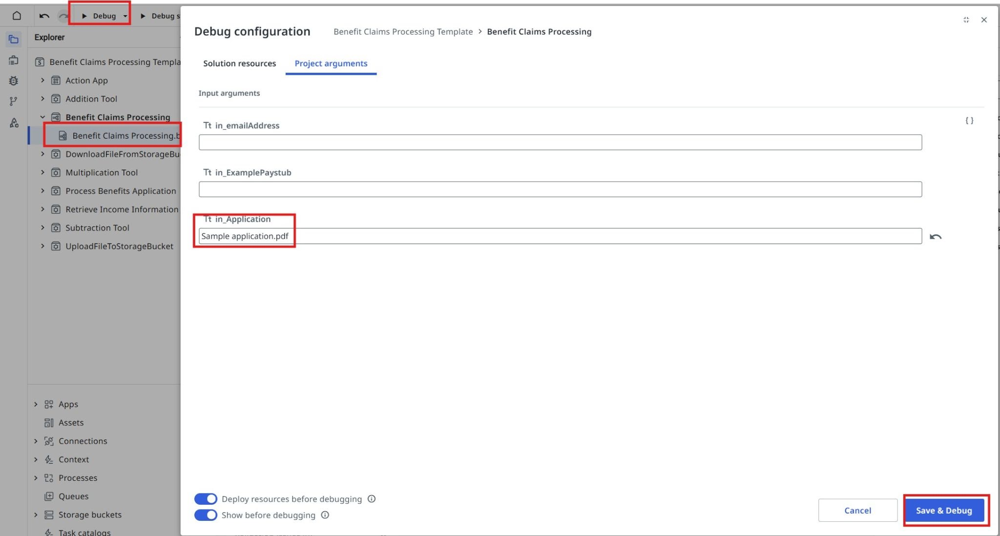{ .screenshot width="900" }

Look at the RPA workflow input/output variables and the execution paths you configured.

Observe the execution. Is the flow taking the correct path (according to the conditions you
configured)?

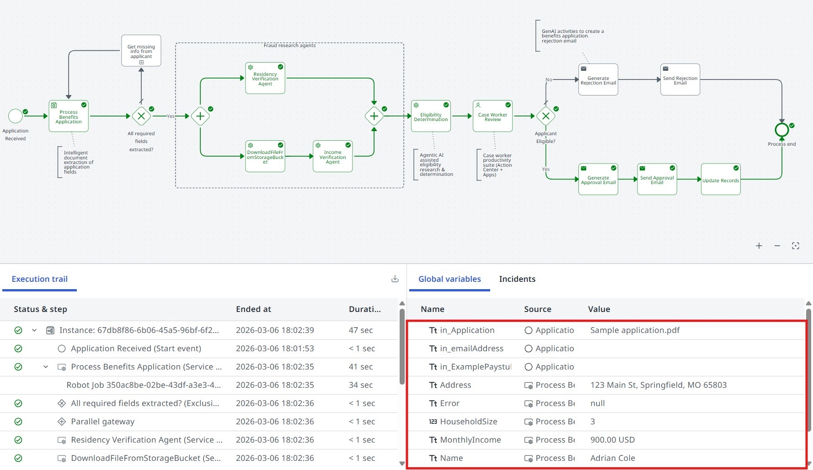{ .screenshot width="900" }

**Time to move to the next one!**
