# Build an Agent and add it to the workflow

!!! tip "Here is our plan for this lesson:"

    1. Build the **Residency Verification** AI Agent from scratch in **Studio Web**
        - Agent will use the declared applicant's address and SSN (extracted using IXP and RPA)
        - If there is a mismatch between the declared address and the address in internal records, the agent will highlight it
    2. Configure testing and build an evaluations dataset to ensure quality of the Agent (optional)
    3. Configure the Agent in the Maestro workflow
    4. Use the output of the Agent when presenting the Benefits Claim case to a human for review

## Goal

Compare the benefits applicant's declared residency address with the address from internal records.
LLMs are ideal for this job — because the formatting of the two addresses can be different but still
point to the same location. LLMs can be instructed to treat such scenarios accordingly.

## Let's build an AI Agent!

Let's use Studio to create our **Residency Verification Agent**!

[[[
Here is the structure of the agent's inputs and outputs.
|30|
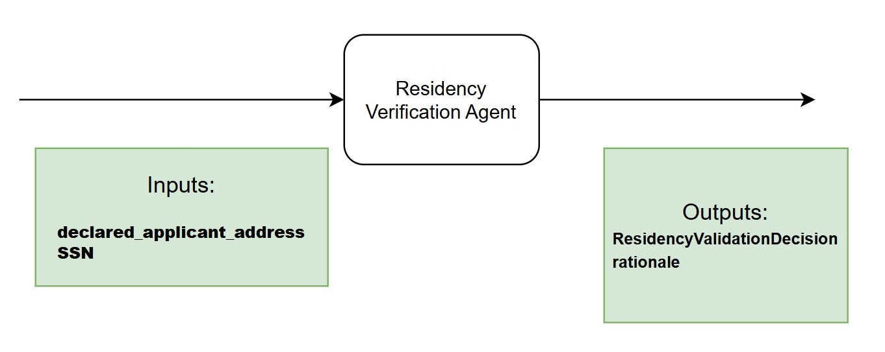{ .screenshot }
]]]

## Steps

### 1. Add the agent to your solution

[[[
First, **add new agent** to your solution.

Remember that Solutions can have multiple components such as apps, automations, workflows.
|50|
{ .screenshot }
]]]

Dismiss Autopilot screen when you see a prompt to generate a new agent. Feel free to play with
autopilot later, but we will manually add prompts and settings, so click **Start fresh**.

Set agent's name to something meaningful, for example **Residency Verification Agent**. Let's keep it
well organized!

{ .screenshot width="900" }

### 2. Choose the model

When it comes to LLMs there is no vendor lock for UiPath Agents, so you can experiment with different
models and choose the one that best fits your use case.

For now, we are going to choose **GPT 5.4** for our agent, but feel free to experiment with different
models later. Let's choose the model from the agent settings (right side toolbar).

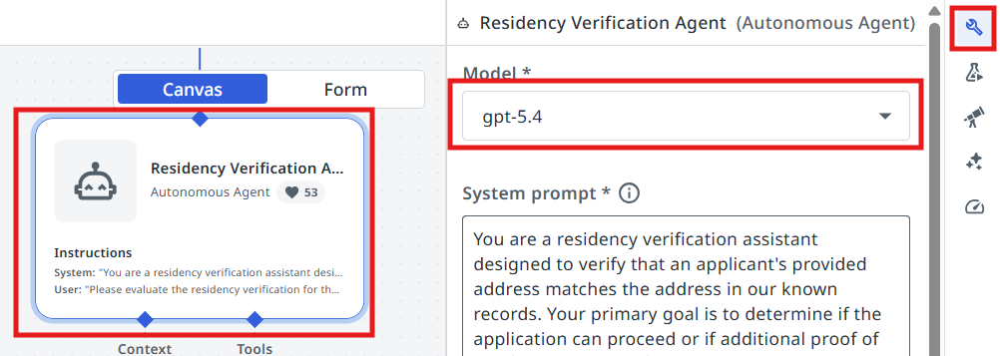{ .screenshot width="900" }

## Configuring the input/output schemas

Next we are going to create the **input and output arguments** of the Agent. Let's understand what we
are going to use the arguments for:

**Agent arguments** let your agent take in information about a business case and return a result,
just as you might have activities or processes do. This can allow you to pass information from a
trigger in Orchestrator or use the output of an agent to launch another automation.

### 3. Create the arguments

[[[
Let's go to **Data Manager** and create our arguments.
|30|
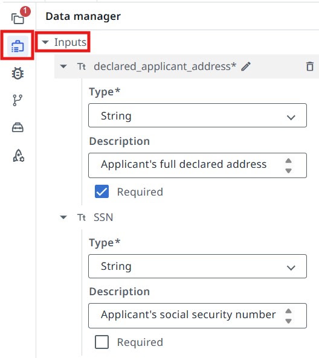{ .screenshot }
]]]

**Input arguments:**

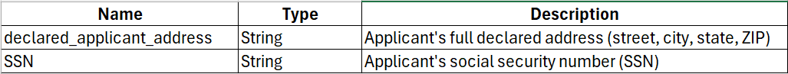{ .screenshot width="900" }

[[[
**Output arguments:**
|30|
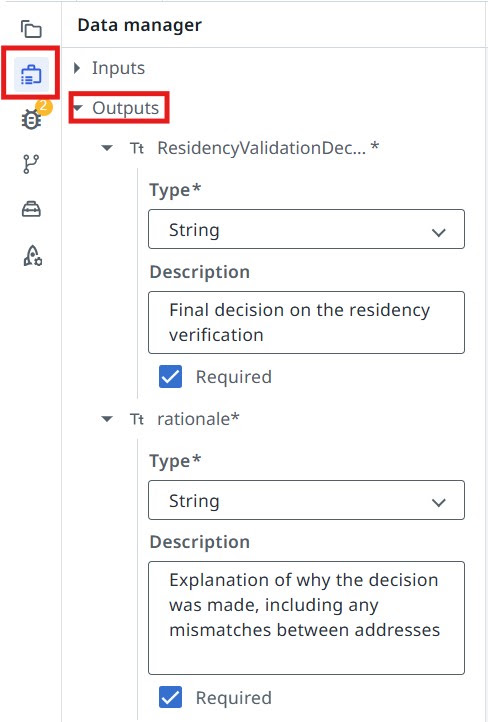{ .screenshot }
]]]

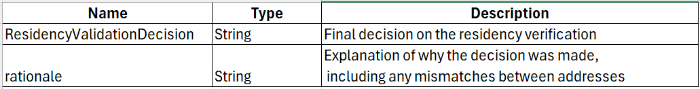{ .screenshot width="900" }

## Context Grounding

[Context Grounding](https://docs.uipath.com/automation-cloud/automation-cloud/latest/admin-guide/about-context-grounding)
is a component of the UiPath AI Trust Layer which allows you to bring in your data to generate more
accurate, reliable GenAI predictions. Context Grounding is designed to make your business data
LLM-ready without the need for any additional subscription to embedding models, vector databases, or
large language models (LLMs).

[[[
In this case, we are going to use context grounding to provide the agent with residency records to
match with the applicant's declared residency address.

Our residency records index contains a txt file with the information structured in a JSON format, so
we are going to use the
[Semantic](https://docs.uipath.com/agents/automation-cloud/latest/user-guide/agent-contexts)
context grounding search strategy.

We are going to use the index named **Residency Verification** (which is already created).
|50|
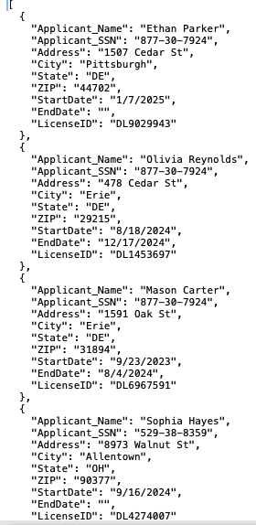{ .screenshot }
]]]

### 4. Add the context to the agent

Let's configure our agent to use it.

[[[
Click on the **Add Context** button.
|30|
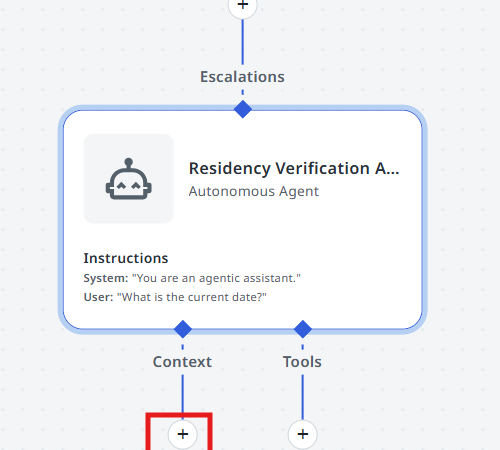{ .screenshot }
]]]

[[[
Select the **Residency Verification** index.
|50|
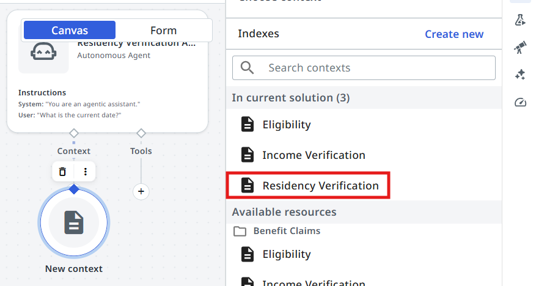{ .screenshot }
]]]

[[[
Select the **Semantic** search strategy.
|30|
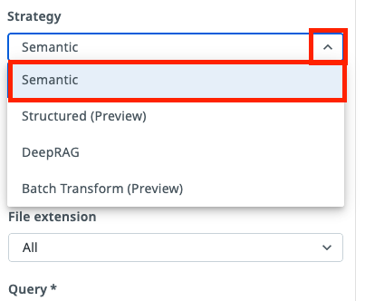{ .screenshot }
]]]

## Configuring Agent's Prompts

> Precision in prompts, like in coding, leads to powerful and predictable results. If your prompt is
> messy, expect messy output. Treat it like code, and write every word with purpose!
>
> — *another advice from gpt-4o*

{ width="260" }

First, let's understand the difference between **System prompt** and **User prompt**.

System Prompts provide consistent guidelines that define an agent's role and capabilities, while User
Prompts direct its attention to specific tasks and input parameters. Understanding this distinction is
essential for effectively designing and implementing AI agents that can perform complex tasks while
maintaining appropriate operational boundaries.

- **System prompt** — allows you to describe in natural language the agent's role, goal and constraints. You specify any rules for it to follow, and information about when it might want to use certain tools, escalations, or context – all of which we'll cover later in this guide.
- **User prompt** — User prompts allow you to structure how the inputs/arguments are passed to the agent, and you can also show in the user prompt how we'll refer to certain inputs in the system prompt.

### 5. Write the System Prompt

Let's start with the **System Prompt**. Copy the following and paste it into your **System Prompt**:

```text
You are a residency verification assistant designed to verify that an applicant's provided address matches the address in our known records. Your primary goal is to determine if the application can proceed or if additional proof of residency is required.
##Instructions##
1. Search for the applicant's address in the Residency Verification index. Applicant's SSN should match the input SSN.
- If the address fully matches (Address, City, State, ZIP), set ##ResidencyValidationDecision## value as "Valid"
- If one or more address fields do not match (Address, City, State, ZIP), set ##ResidencyValidationDecision## value as "Invalid"
- If multiple addresses are found for the same SSN, try to match each one of them with the declared address and return "Valid" if one of them is a match. **DO NOT** mix and match address fields from one record to another. All fields should match from one record.
- If the applicant's address can't be found based on the SSN, set ##ResidencyValidationDecision## value as "Invalid"
- In the ##rationale## output field provide an explanation for your decision
##Matching rules##
- Ignore trailing spaces and any other formatting differences. The Address, City, State, Zip should still be considered a match if they point to the same location but formatting is different.
Always maintain a professional and impartial tone in your evaluations. Your assessments should be based solely on the address comparisons, without referencing external databases or services.
```

### 6. Write the User Prompt

**User Prompt** connects it all together. In our case, the user prompt looks like this — paste it into
your **User Prompt**:

```text
Please evaluate the residency verification for the following applicant:
Applicant Address: {{declared_applicant_address}}
SSN: {{SSN}}
```

### 7. Test the agent

Time to test it by giving it some sample inputs. Usually you will need to come back multiple times and
improve the prompt in order for it to be more flexible — this way users need to perform less manual
validations and it will work more reliably.

Let's test the following scenarios.

=== "Valid — record matches"

    The SSN and address pair exist in the records.

    ```text
    SSN: 617-87-1434
    Declared applicant address: 2381 Pine Rd, Lancaster, OH, 37661
    ```

    Output should be **ResidencyValidationDecision: Valid**

=== "Invalid — no such record"

    The SSN and address pair does not exist in the records.

    ```text
    SSN: 342-23-8721
    Declared applicant address: 2312 Victory Ave, Columbus, OH, 72512
    ```

    Output should be **ResidencyValidationDecision: Invalid**

=== "Invalid — SSN matches, address differs"

    What if the SSN exists in our records, but points to a different address?

    ```text
    SSN: 617-87-1434
    Declared applicant address: 2381 Random St, Lancaster, OH, 37661
    ```

    Output should be **ResidencyValidationDecision: Invalid**

## Quality Control and Evaluations

How about giving our agent a thorough testing?

- Imagine that tomorrow a brand new model is released, or for some reason, for example cost, you would like to switch to an alternative LLM. How would you ensure that this change will not disrupt agent's result?
- What if during numerous improvements and fine tuning of prompt previous document samples do not work anymore?

The solution is in automated testing, just like we do with Robots, or pretty much any other source
code. Let's build Evaluations that help us with automatic validation of results for a set of
predefined samples.

An [evaluation](https://docs.uipath.com/agents/automation-cloud/latest/user-guide/agent-evaluations)
is a pair between an input and an assertion — or evaluator — made on the output. The evaluator is a
defined condition or rule used to assess whether the agent's output meets the expected output or
expected trajectory.

There are three main categories of evaluators:

**LLM-as-a-Judge:**

- Recommended as the default approach when targeting the root output.
- Provides flexible evaluation of complex outputs.
- Best used when evaluating reasoning, natural language responses, or complex structured outputs.

**Deterministic**

- Recommended when expecting exact matches.
- Most effective when output requirements are strictly defined
- Works with complex objects, but is best used with:
    - Boolean responses (true/false)
    - Specific numerical values
    - Exact string matches
    - Array of primitives

**Trajectory**

- Used to judge the agent's overall behavior based on its run history and expected behavior.

Our Agent has the following output fields:

- **ResidencyValidationDecision** — "Valid" or "Invalid" — **deterministic output**
- **rationale** — Explanation of why the decision was made, including any mismatches between addresses — **dynamic output**

Let's assume we want to test the **ResidencyValidationDecision** field. To do that, we will use a
deterministic evaluator.

### 8. Create the evaluator

Go to **Evaluators** and click **Create New**.

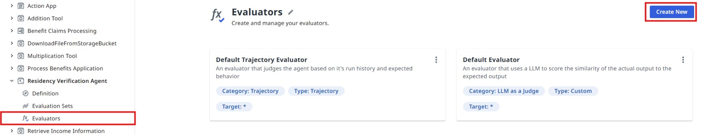{ .screenshot width="900" }

[[[
Select **Exact match** evaluator type.
|50|
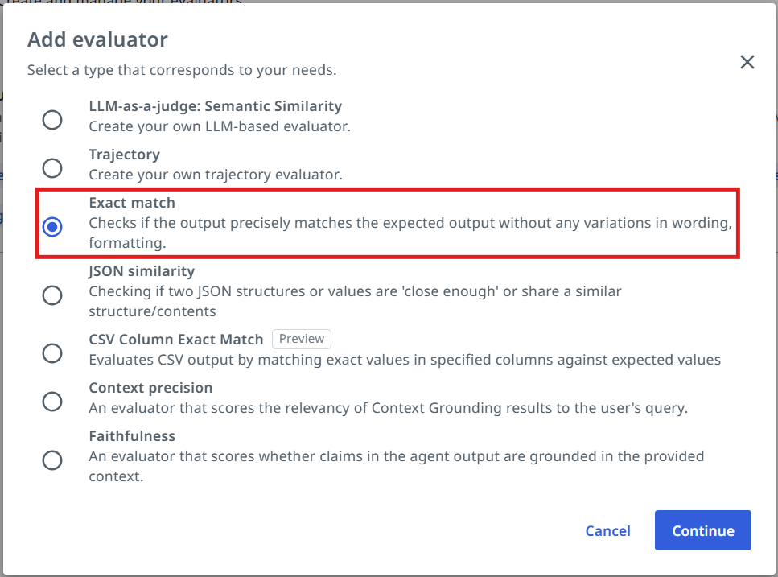{ .screenshot }
]]]

[[[
Let's give our evaluator a name:

```text
Residency Validation Evaluator
```

The field we want to evaluate is:

```text
ResidencyValidationDecision
```
|50|
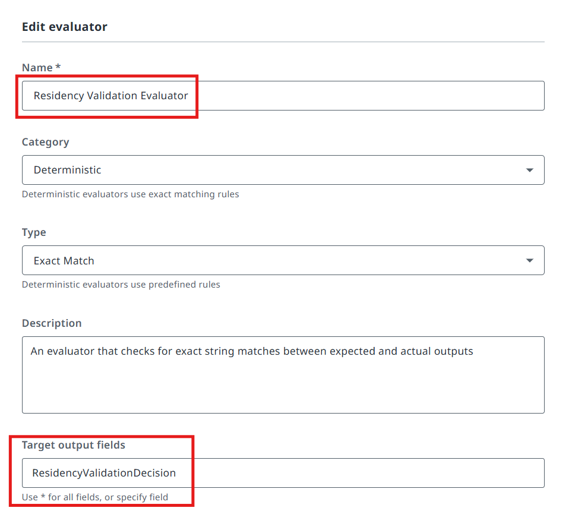{ .screenshot }
]]]

### 9. Import the evaluation set

Let's now import an evaluation set to test our agent.

Click on **Evaluation Sets** and then on the **Import** button.

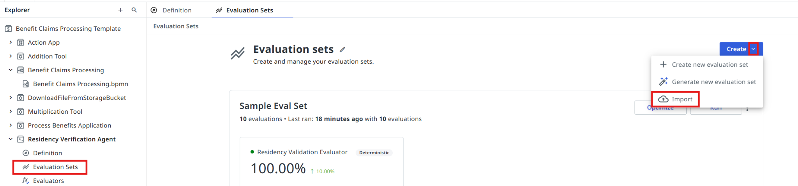{ .screenshot width="900" }

Copy this evaluation set:

```json
{"fileName":"evaluation-set-1774447972390.json","id":"a8246f97-e10e-4e50-9f7e-a7cac5d449c4","name":"Sample Eval Set","batchSize":10,"evaluatorRefs":["c4fb87ea-3cec-4435-b69c-64f090e7f1c8"],"evaluations":[{"id":"668b7745-4205-4d06-9ab6-f5379f40b20b","name":"Valid 1","inputs":{"declared_applicant_address":"Pittsburgh DE 44702, 1507 Cedar St","SSN":"877-30-7924"},"expectedOutput":{"ResidencyValidationDecision":"Valid","rationale":".."},"simulationInstructions":"","expectedAgentBehavior":"","simulateInput":false,"inputGenerationInstructions":"","simulateTools":false,"toolsToSimulate":[],"evalSetId":"a8246f97-e10e-4e50-9f7e-a7cac5d449c4","createdAt":"2026-03-25T14:15:27.208Z","updatedAt":"2026-03-25T14:15:27.208Z","source":"manual"},{"id":"05ca532e-e889-4123-996d-41240b20ad05","name":"Valid 2","inputs":{"declared_applicant_address":"7837 Oak St | 68619 Harrisburg DE","SSN":"633-81-2446"},"expectedOutput":{"ResidencyValidationDecision":"Valid","rationale":".."},"simulationInstructions":"","expectedAgentBehavior":"","simulateInput":false,"inputGenerationInstructions":"","simulateTools":false,"toolsToSimulate":[],"evalSetId":"a8246f97-e10e-4e50-9f7e-a7cac5d449c4","createdAt":"2026-03-25T14:15:51.099Z","updatedAt":"2026-03-25T14:15:51.099Z","source":"manual"},{"id":"3661ee2a-a61e-4b80-adfd-9dd45c57bb6b","name":"Valid 3","inputs":{"declared_applicant_address":"OH, Allentown 90377 - 8973 Walnut St","SSN":"529-38-8359"},"expectedOutput":{"ResidencyValidationDecision":"Valid","rationale":".."},"simulationInstructions":"","expectedAgentBehavior":"","simulateInput":false,"inputGenerationInstructions":"","simulateTools":false,"toolsToSimulate":[],"evalSetId":"a8246f97-e10e-4e50-9f7e-a7cac5d449c4","createdAt":"2026-03-25T14:16:13.619Z","updatedAt":"2026-03-25T14:16:13.619Z","source":"manual"},{"id":"6ff0eca0-8b8f-429a-8633-13f26fa14d92","name":"Valid 4","inputs":{"declared_applicant_address":"York 94296 DE, 131 Pine Rd","SSN":"902-37-0293"},"expectedOutput":{"ResidencyValidationDecision":"Valid","rationale":".."},"simulationInstructions":"","expectedAgentBehavior":"","simulateInput":false,"inputGenerationInstructions":"","simulateTools":false,"toolsToSimulate":[],"evalSetId":"a8246f97-e10e-4e50-9f7e-a7cac5d449c4","createdAt":"2026-03-25T14:17:12.679Z","updatedAt":"2026-03-25T14:17:12.679Z","source":"manual"},{"id":"6c8f0140-9ba0-46a3-bf9e-b3df9e41ab9a","name":"Valid 5","inputs":{"declared_applicant_address":"PA 11866 Harrisburg, Walnut St 9089","SSN":"617-87-1434"},"expectedOutput":{"ResidencyValidationDecision":"Valid","rationale":".."},"simulationInstructions":"","expectedAgentBehavior":"","simulateInput":false,"inputGenerationInstructions":"","simulateTools":false,"toolsToSimulate":[],"evalSetId":"a8246f97-e10e-4e50-9f7e-a7cac5d449c4","createdAt":"2026-03-25T14:17:30.751Z","updatedAt":"2026-03-25T14:17:30.751Z","source":"manual"},{"id":"78b092c2-8340-4310-8acd-2f56f30c14ac","name":"Invalid 1","inputs":{"declared_applicant_address":"Erie DE 29215, 478 Random St","SSN":"877-30-7924"},"expectedOutput":{"ResidencyValidationDecision":"Invalid","rationale":".."},"simulationInstructions":"","expectedAgentBehavior":"","simulateInput":false,"inputGenerationInstructions":"","simulateTools":false,"toolsToSimulate":[],"evalSetId":"a8246f97-e10e-4e50-9f7e-a7cac5d449c4","createdAt":"2026-03-25T14:18:33.112Z","updatedAt":"2026-03-25T14:18:33.112Z","source":"manual"},{"id":"9dc5146f-41f6-46c7-9472-7fa17a647e77","name":"Invalid 2","inputs":{"declared_applicant_address":"WV 56604 Erie - Oak St 3814","SSN":"529-38-8359"},"expectedOutput":{"ResidencyValidationDecision":"Invalid","rationale":".."},"simulationInstructions":"","expectedAgentBehavior":"","simulateInput":false,"inputGenerationInstructions":"","simulateTools":false,"toolsToSimulate":[],"evalSetId":"a8246f97-e10e-4e50-9f7e-a7cac5d449c4","createdAt":"2026-03-25T14:19:54.002Z","updatedAt":"2026-03-25T14:32:14.186Z","source":"manual"},{"id":"05805e06-b628-4010-8928-32277aad9a35","name":"Invalid 3","inputs":{"declared_applicant_address":"35782 WV Harrisburg, Test Ave 3712","SSN":"633-81-2446"},"expectedOutput":{"ResidencyValidationDecision":"Invalid","rationale":".."},"simulationInstructions":"","expectedAgentBehavior":"","simulateInput":false,"inputGenerationInstructions":"","simulateTools":false,"toolsToSimulate":[],"evalSetId":"a8246f97-e10e-4e50-9f7e-a7cac5d449c4","createdAt":"2026-03-25T14:20:16.156Z","updatedAt":"2026-03-25T14:32:31.796Z","source":"manual"},{"id":"52d6f080-7f69-4680-a0f1-3c242e4a0d20","name":"Invalid 4","inputs":{"declared_applicant_address":"Scranton NY 66875 St. Mark's St 6465","SSN":"902-37-0293"},"expectedOutput":{"ResidencyValidationDecision":"Invalid","rationale":".."},"simulationInstructions":"","expectedAgentBehavior":"","simulateInput":false,"inputGenerationInstructions":"","simulateTools":false,"toolsToSimulate":[],"evalSetId":"a8246f97-e10e-4e50-9f7e-a7cac5d449c4","createdAt":"2026-03-25T14:20:42.623Z","updatedAt":"2026-03-25T14:33:05.261Z","source":"manual"},{"id":"0ea8aa7f-f4c2-404a-891a-d6d91a2a6863","name":"Invalid 5","inputs":{"declared_applicant_address":"DE 43995, Harrisburg, 4899 Canal St","SSN":"617-87-1434"},"expectedOutput":{"ResidencyValidationDecision":"Invalid","rationale":".."},"simulationInstructions":"","expectedAgentBehavior":"","simulateInput":false,"inputGenerationInstructions":"","simulateTools":false,"toolsToSimulate":[],"evalSetId":"a8246f97-e10e-4e50-9f7e-a7cac5d449c4","createdAt":"2026-03-25T14:21:01.791Z","updatedAt":"2026-03-25T14:33:20.797Z","source":"manual"}],"modelSettings":[],"createdAt":"2026-03-25T14:12:52.390Z","updatedAt":"2026-03-25T14:33:20.797Z","agentMemoryEnabled":false,"agentMemorySettings":[],"lineByLineEvaluation":false}
```

[[[
Paste it into the import window. After that click the **Import** button.
|50|
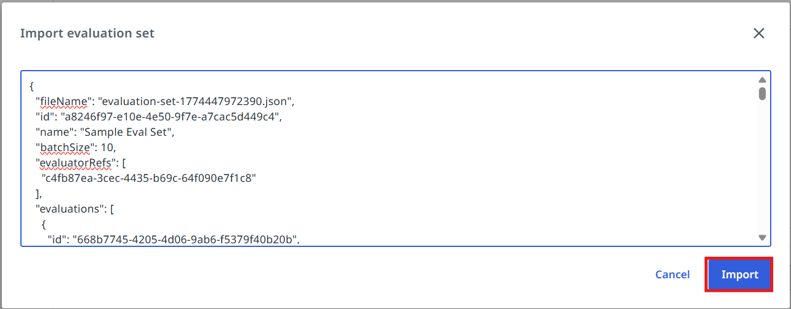{ .screenshot }
]]]

Navigate to the evaluation set and open it.

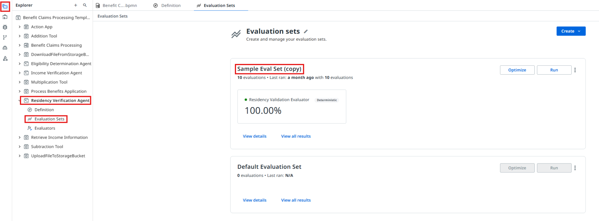{ .screenshot width="900" }

[[[
Open the evaluation set and select the **Residency Validation Evaluator** that we configured earlier.
|50|
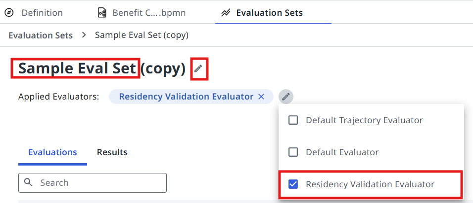{ .screenshot }
]]]

[[[
Evaluate the set and discuss the results with the trainer.
|30|
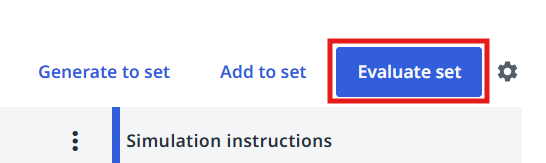{ .screenshot }
]]]

## Configuring the Agentic Task in Maestro

Let's get back to Studio and continue editing our Agentic Process.

### 10. Point the task at your agent

[[[
Configure the **Residency Verification Agent** task to use our freshly prepared AI Agent! This is
done in the same way as the Robotic task: pick **Start and wait for agent**, then search for the
agent in your solution.
|30|
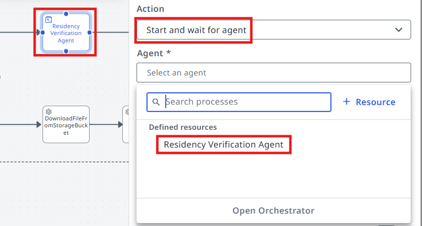{ .screenshot }
]]]

### 11. Map the inputs

[[[
Now we need to pick outputs from the previous RPA Task (Process Benefits Application), and add them as
inputs to the Agent — here is how you do it in your Agentic task's **Settings**.
|30|
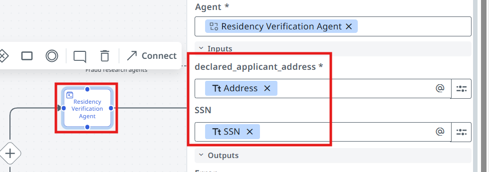{ .screenshot }
]]]

In the end:

- Robot's **Address** should map into Agent's **declared_applicant_address**
- Robot's **SSN** should map into Agent's **SSN**

### 12. Run it

Process is ready for testing — click on the **Debug** button! This time we can check the output of the
**Residency Verification Agent**.

!!! warning "Remember the input argument"
    Pass the value `Sample application.pdf` for the `in_Application` argument in the debug panel.

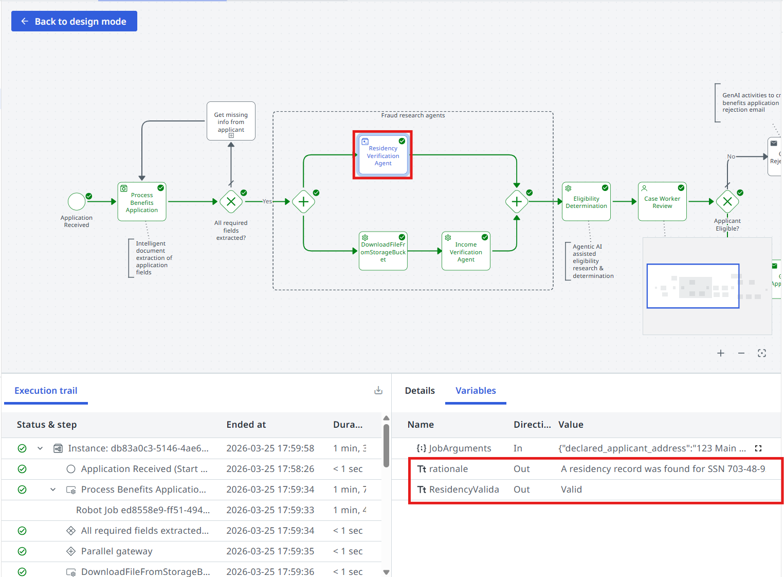{ .screenshot width="900" }

**Time to move to the next one!**
