# Build an Agent and add it to the workflow

!!! tip "Here is our plan for this lesson:"

    1. Configure an RPA workflow to download the necessary documents
    2. Build the **Income Verification** AI Agent from scratch in **Studio Web**
        - Agent will use the applicant's paystub document to extract the applicant's Name, Social Security Number (SSN) and the monthly income
        - Based on that, the agent will use a tool to extract income information from internal records (a [Data Fabric entity](https://docs.uipath.com/data-service/automation-cloud/latest/user-guide/introduction))
        - The agent will compare the paystub income against the existing records
    3. Configure testing and build an evaluations dataset to ensure quality of the Agent (optional)
    4. Configure the Agent in the Maestro workflow
    5. Use the output of the Agent when presenting the Benefits Claim case to a human for review

## Goal

Compare the benefits applicant's monthly income against our existing records. The agent decides:

- If the paystub income matches the existing records income, the decision is **valid**
- If there is any discrepancy, the decision is **invalid**
- If the paystub or existing records data is missing, the decision is **invalid**

LLMs are ideal for this job — because the formatting of the two input paystubs can be different but
still contain the necessary information. LLMs can be instructed to treat such scenarios accordingly.

## Triggering an RPA workflow

In our scenario, the agent receives as an input a paystub document containing the benefits
applicant's details and monthly income. This document is stored inside an
[Orchestrator Storage Bucket](https://docs.uipath.com/orchestrator/automation-cloud/latest/user-guide/about-storage-buckets).

We need to download this document and pass it as a variable to our agent. To do that, we will use an
RPA workflow.

Our RPA workflow is already part of the solution and is called **DownloadFileFromStorageBucket**. Get
familiar with it by taking a look inside. It will receive a storage bucket filepath as input and will
output the file as a variable.

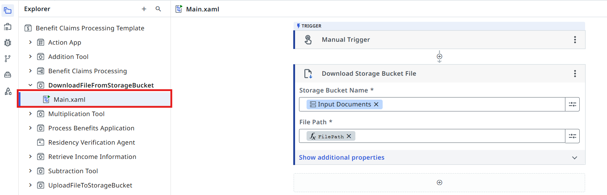{ .screenshot width="900" }

[[[
**DownloadFileFromStorageBucket** inputs and outputs.
|30|
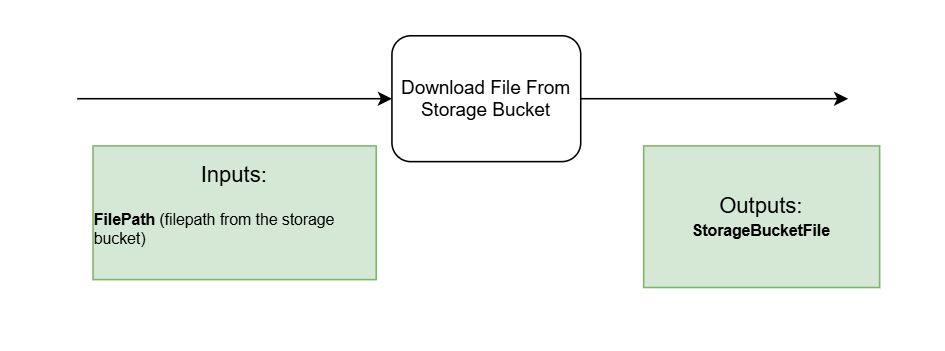{ .screenshot }
]]]

## Steps

### 1. Point the task at the RPA workflow

[[[
Let's go back to the Agentic Process diagram and update our task:

- Open the properties panel of the **DownloadFileFromStorageBucket** task by clicking on it
- Pick **Start and wait for RPA workflow** as the task's Action type
|50|
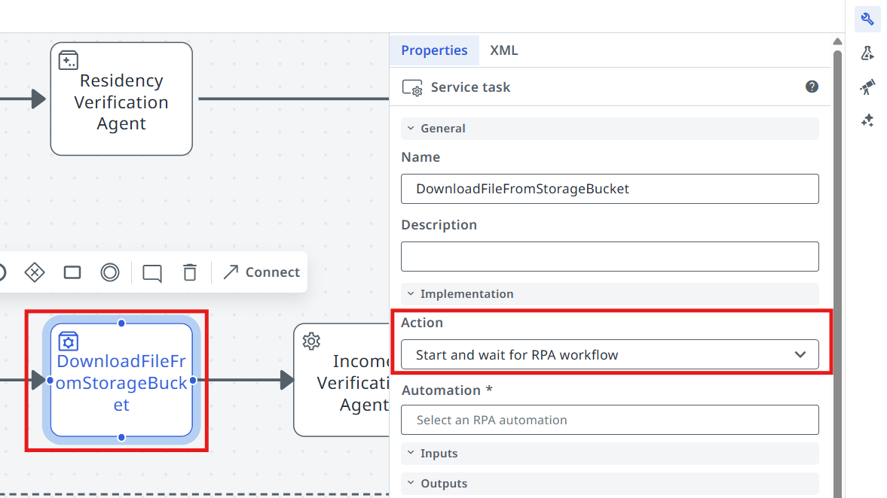{ .screenshot }
]]]

[[[
Select the **DownloadFileFromStorageBucket** tool.
|30|
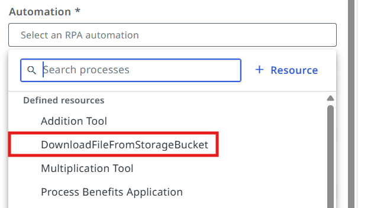{ .screenshot }
]]]

[[[
Pass the **in_ExamplePaystub** argument as input for the FilePath.
|30|
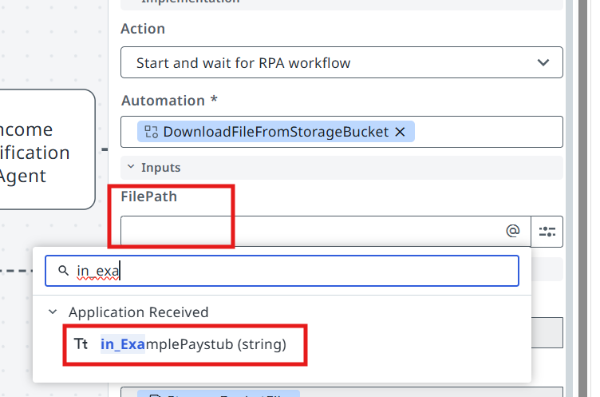{ .screenshot }
]]]

## Let's build an AI Agent!

Let's use Studio to create our **Income Verification Agent**!

[[[
Here is the structure of the agent's inputs and outputs.
|30|
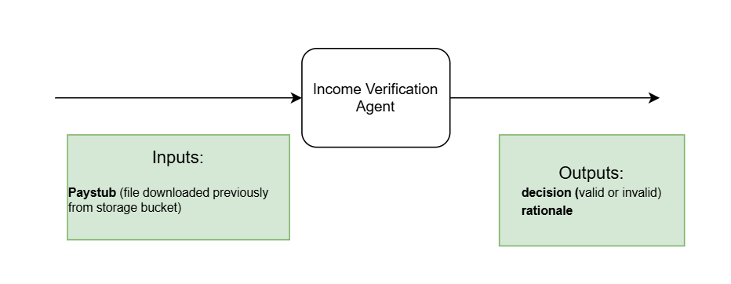{ .screenshot }
]]]

### 2. Add the agent to your solution

[[[
First, **add new agent** to your solution.

Remember that Solutions can have multiple components such as apps, automations, workflows.
|50|
{ .screenshot }
]]]

Dismiss Autopilot screen when you see a prompt to generate a new agent. Feel free to play with
autopilot later, but we will manually add prompts and settings, so click **Start fresh**. Select the
**Autonomous** agent option.

Set agent's name to something meaningful, for example **Income Verification Agent**. Let's keep it
well organized!

{ .screenshot width="900" }

### 3. Choose the model

[[[
When it comes to LLMs there is no vendor lock for UiPath Agents, so you can experiment with different
models and choose the one that best fits your use case.

For now, we are going to choose **GPT 5** for our agent, but feel free to experiment with different
models later. Let's choose the model from the agent settings (right side toolbar).
|50|
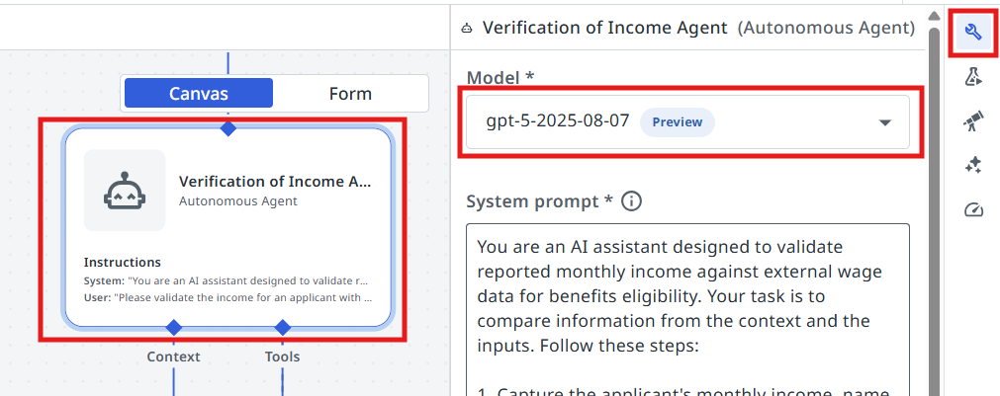{ .screenshot }
]]]

## Configuring the input/output schemas

Next we are going to create the **input and output arguments** of the Agent. Let's understand what we
are going to use the arguments for:

**Agent arguments** let your agent take in information about a business case and return a result, just
as you might have activities or processes do. This can allow you to pass information from a trigger in
Orchestrator or use the output of an agent to launch another automation.

### 4. Create the arguments

[[[
Let's go to **Data Manager** and create our arguments.
|30|
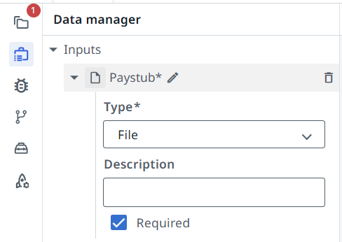{ .screenshot }
]]]

**Input arguments:**

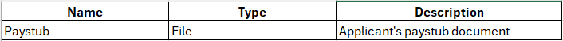{ .screenshot width="900" }

[[[
**Output arguments:**
|50|
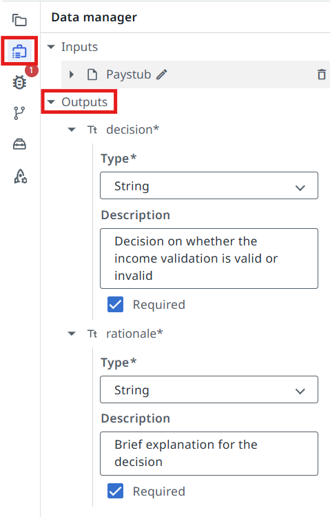{ .screenshot }
]]]

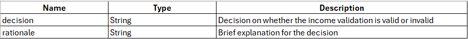{ .screenshot width="900" }

## Tools

Agent by itself is good at making decisions and analyzing data. But LLMs naturally can't go and
interact with databases and applications... yet. We are going to use
[tools](https://docs.uipath.com/agents/automation-cloud/latest/user-guide/agent-tools) for that. Tools
offer agents both access to critical context from data stored in business applications, and the
ability to execute actions based on objectives outlined in the prompt. Tools are how the agent's
reasoning and planning can turn into action.

There are various kind of tools we can configure for our agents:

- RPA Workflows
- Integration Service Activities
- Other Agents
- Specialized tools (example: **Analyze Files**)

Our agent needs to analyze a Paystub File and also search for corresponding records in a Data Fabric
Entity, so we are going to use the following tools:

- The **Analyze Files** tool to extract the relevant information from the paystub
- **Retrieve Income Information** tool — an RPA workflow, which receives the applicant's SSN as an input and searches for income records in a Data Fabric entity.

### 5. Add the Analyze Files tool

Let's add the two tools to our agent, starting with the **Analyze Files** tool.

[[[
Click the **+** button in the tools section.
|30|
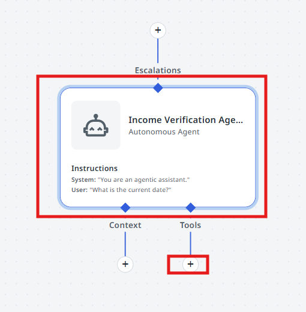{ .screenshot }
]]]

[[[
Search for the **Analyze Files** tool and select it.
|50|
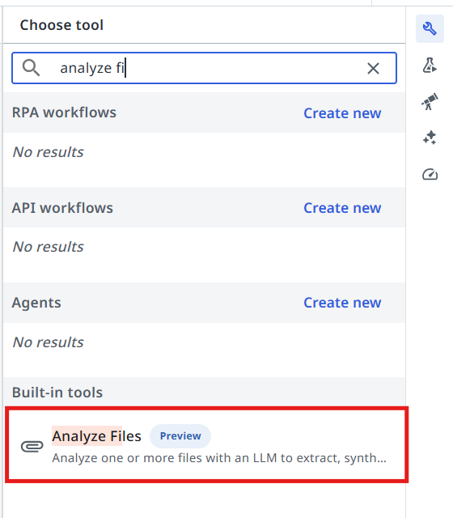{ .screenshot }
]]]

### 6. Add the Retrieve Income Information tool

[[[
Next, let's add the **Retrieve Income Information** RPA tool.
|30|
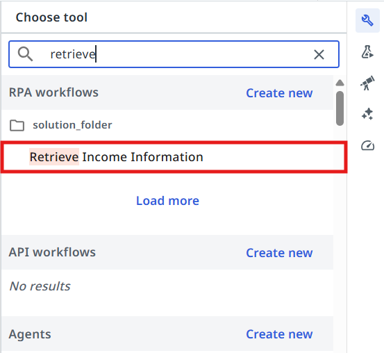{ .screenshot }
]]]

[[[
Pass the following values to the **Retrieve Income Information** tool arguments:

- In the **SSN** field prompt write:

```text
The applicant social security number
```

- In the **Description** field write:

```text
Use this tool to retrieve the income information of the applicant from the records
```
|50|
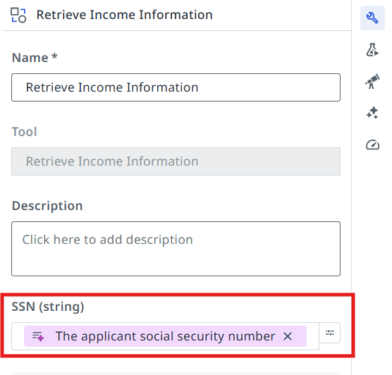{ .screenshot }
]]]

This helps the agent understand what value to pass to the input arguments and when to use the tool.

## Configuring Agent's Prompts

> Precision in prompts, like in coding, leads to powerful and predictable results. If your prompt is
> messy, expect messy output. Treat it like code, and write every word with purpose!
>
> — *another advice from gpt-4o*

{ width="260" }

First, let's understand the difference between **System prompt** and **User prompt**.

System Prompts provide consistent guidelines that define an agent's role and capabilities, while User
Prompts direct its attention to specific tasks and input parameters. Understanding this distinction is
essential for effectively designing and implementing AI agents that can perform complex tasks while
maintaining appropriate operational boundaries.

- **System prompt** — allows you to describe in natural language the agent's role, goal and constraints. You specify any rules for it to follow, and information about when it might want to use certain tools, escalations, or context – all of which we'll cover later in this guide.
- **User prompt** — User prompts allow you to structure how the inputs/arguments are passed to the agent, and you can also show in the user prompt how we'll refer to certain inputs in the system prompt.

### 7. Write the System Prompt

Let's start with the **System Prompt**. Copy the following and paste it into your **System Prompt**:

```text
You are an AI assistant designed to validate reported monthly income against external wage data for benefits eligibility. Your task is to compare information from the context and the inputs. Follow these steps:
1. Capture the applicant's monthly income, name and social security number from the input Paystub file.
- Social security number is found under the field names "Employee ID" inside the paystub file.
2. Use the ##Retrieve Income Information## tool to extract the applicant's income information from the existing records.
3. Compare the Paystub income against the extracted income.
- if the paystub income matches exactly with the extracted income, set ##decision## to "valid"
- if there is any discrepancy, set ##decision## to "invalid".
4. If the paystub or existing records data is missing, do not throw an error. Instead, set ##decision## to "invalid".
5. In the ##rationale## field, provide a brief explanation around the decision you've taken.
Maintain confidentiality and handle sensitive information with care.
##Example Scenarios
1. Valid case:
Input: Reported monthly income: $3000, Extracted income: $3000
Output:
{
"decision": "valid",
"rationale": "All sources match the reported income."
}
2. Invalid case:
Input: Reported monthly income: $3000, Extracted income: $3500
Output:
{
"decision": "invalid",
"rationale": "Existing records shows higher income than reported. Verification required."
}
3. Missing/empty/zero data case:
Input: Reported monthly income: $3000, Extracted income: 0
Output:
{
"decision": "invalid",
"rationale": "No income records found. Manual review required."
}
```

### 8. Write the User Prompt

**User Prompt** connects it all together. In our case, the user prompt looks like this — paste it into
your **User Prompt**:

```text
Please validate the income for an applicant with the following information:
Paystub: {{Paystub}}
```

### 9. Test the agent

Time to test it by giving it some sample inputs. Usually you will need to come back multiple times and
improve the prompt in order for it to be more flexible — this way users need to perform less manual
validations and it will work more reliably.

!!! note "Test files"
    You can find the files for testing in the shared resources.

    - Link: [view.highspot.com/viewer/01988c165ebd35be0b21e64eaaa149e5](https://view.highspot.com/viewer/01988c165ebd35be0b21e64eaaa149e5)
    - Passcode: `Shs1*nb2gj3!`

Let's test the following scenarios.

=== "Valid — income matches"

    The SSN is found in the Data Fabric Entity and the monthly income matches.

    ```text
    Paystub_income matching
    ```

    Output should be **decision: valid**

=== "Invalid — income differs"

    The SSN is found in the Data Fabric entity but the income from our records differs from the one in
    the paystub.

    ```text
    Paystub_income not matching
    ```

    Output should be **decision: invalid**

=== "Invalid — SSN not in records"

    What if the SSN does not exist in our records?

    ```text
    Paystub_ssn not in records
    ```

    Output should be **decision: invalid** — because the SSN is not found in the Data Fabric entity

## Configuring the Agentic Task in Maestro

Let's get back to Studio and continue editing our Agentic Process.

### 10. Point the task at your agent

[[[
Configure the **Income Verification Agent** task to use our freshly prepared AI Agent! This is done in
the same way as the Robotic task: pick **Start and wait for agent**, then search for the agent in your
solution.
|50|
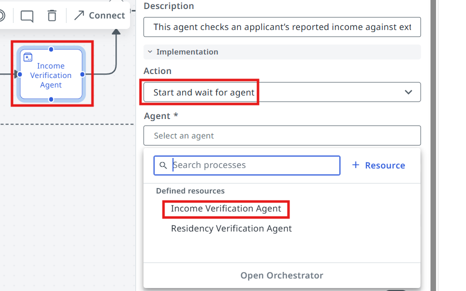{ .screenshot }
]]]

### 11. Map the input

[[[
Now we need to pass the **StorageBucketFile** output of the previous RPA workflow as input to our
agent.
|30|
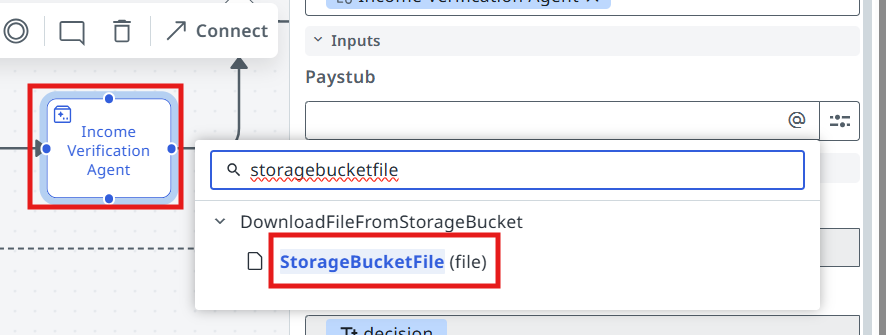{ .screenshot }
]]]

### 12. Run it

[[[
Process is ready for testing — click on the **Debug** button! Pass the following file paths to the
input arguments:

```text
in_ExamplePaystub: Sample pay stub.png
in_Application:    Sample application.pdf
```
|50|
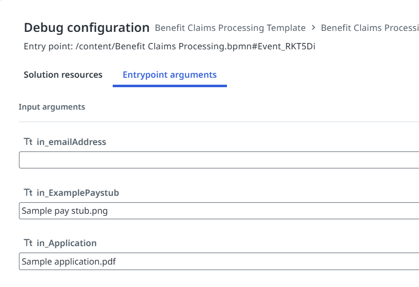{ .screenshot }
]]]

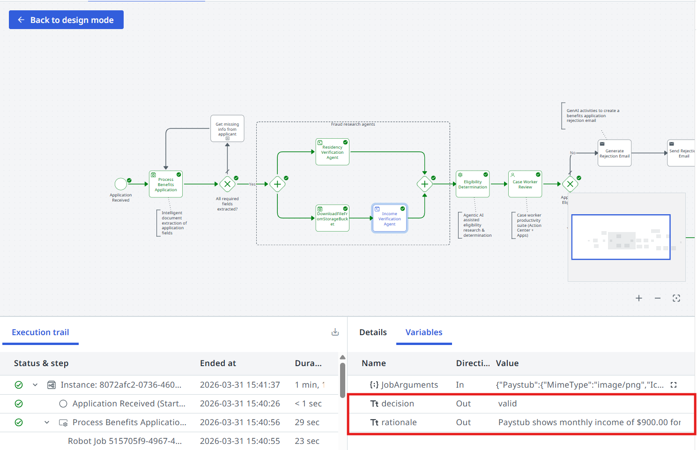{ .screenshot width="900" }

**Time to move to the next one!**
