# Build an Agent and add it to the workflow

!!! tip "Here is our plan for this lesson:"

    1. Build a **Benefit Eligibility Determination** AI Agent from scratch in **Studio Web**
        - Agent will use the declared applicant's household size and monthly gross income
        - Using benefit claims guidelines and rules, as part of context grounding, it will decide
          whether the applicant qualifies, what amount they will receive, and a justification
    2. Configure testing and build an evaluations dataset to ensure quality of the Agent (optional)
    3. Configure the Agent in the Maestro workflow
    4. Use the output of the Agent when presenting the Benefits Claim case to a human for review

## Goal

Implement an agent which decides if the applicant is eligible for benefits and calculates the amount,
according to the guidelines. LLMs are ideal for this job — because the guidelines can be in an
unstructured format. LLMs can be instructed to treat such scenarios accordingly.

## General steps for Eligibility & Calculation

This is a two-phase approach to determine benefits: first verifying household eligibility through
income thresholds, then calculating the actual benefit amount based on net income and household size.

1. **Income Eligibility Check** — Compare the household's gross monthly income against threshold tables based on household size. For example, a single person must have gross income at or below $1,950/month ($23,400/year), while a family of four has a threshold of $4,050/month ($48,600/year). Each additional person adds $700/month to the threshold.
2. **Net Income Calculation** — Apply standard deductions to gross income: $198 for households of 1-3 people, $199 for 4 people, $234 for 5 people, and $268 for 6+ people (2025 rates). This yields the household's net monthly income.
3. **Benefit Determination** — Use the formula below. Maximum benefits range from $300/month for a single person to $1,785/month for 8-person households, with $225 added per additional person beyond 8.

```text
SNAP Benefit = Maximum Benefit for Household Size - (Net Income × 0.15)
```

## Let's build an AI Agent!

Let's use Studio to create our **Eligibility Determination Agent**!

[[[
Here is the structure of the agent's inputs and outputs.
|30|
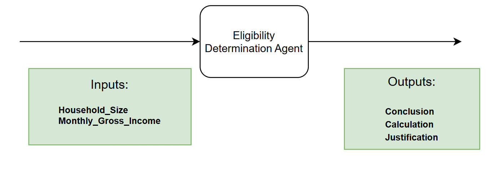{ .screenshot }
]]]

## Steps

### 1. Add the agent to your solution

[[[
First, **add new agent** to your solution.

Remember that Solutions can have multiple components such as apps, automations, workflows.
|50|
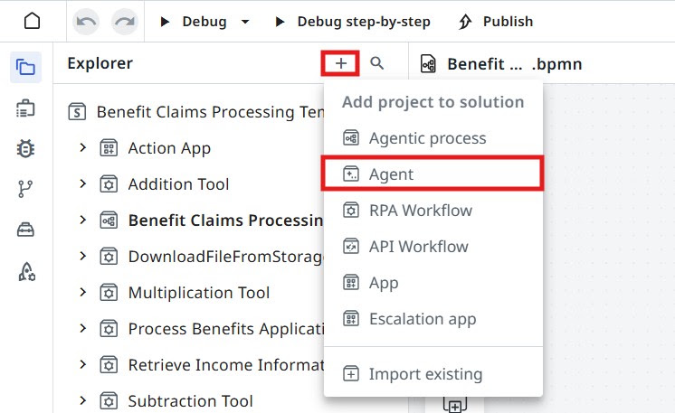{ .screenshot }
]]]

Dismiss Autopilot screen when you see a prompt to generate a new agent. Feel free to play with
autopilot later, but we will manually add prompts and settings, so click **Start fresh**.

Set agent's name to something meaningful, for example **Eligibility Determination Agent**. Let's keep
it well organized!

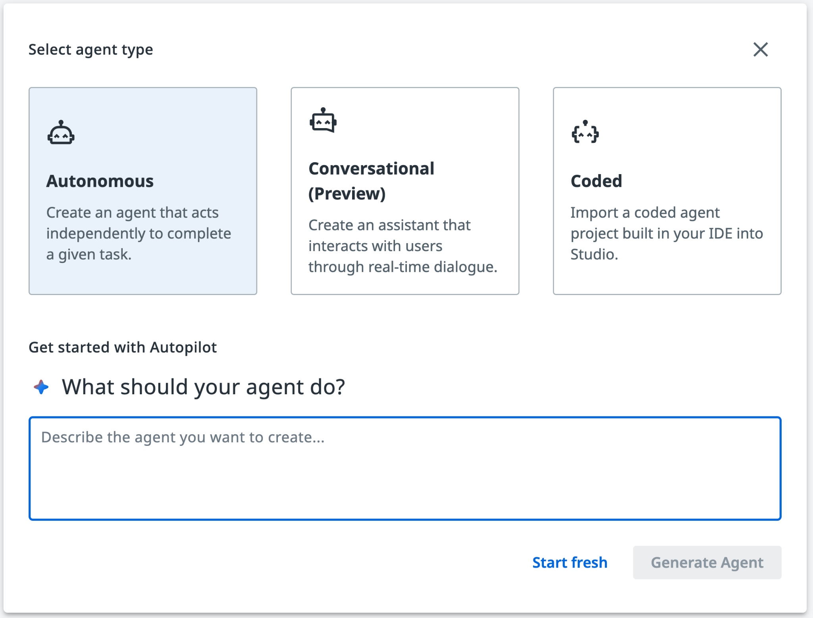{ .screenshot width="900" }

### 2. Choose the model

[[[
When it comes to LLMs there is no vendor lock for UiPath Agents, so you can experiment with different
models and choose the one that best fits your use case.

For now, we are going to choose **GPT-5.4** for our agent, but feel free to experiment with different
models later. Let's choose the model from the agent settings (right side toolbar).
|50|
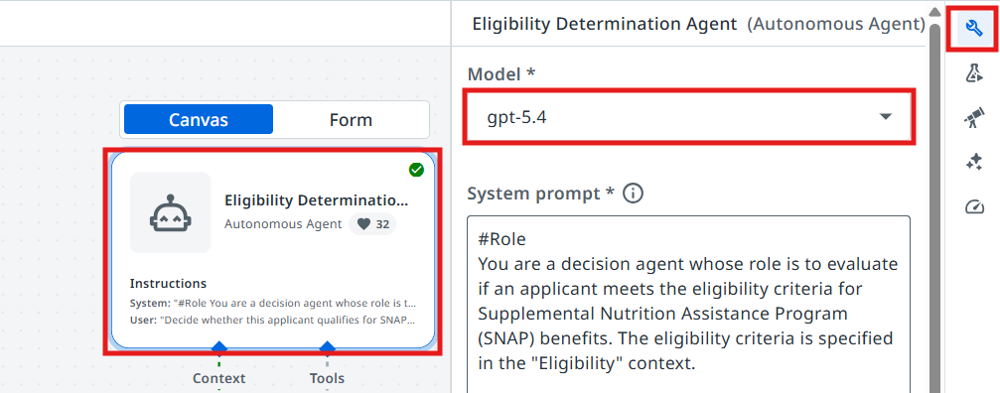{ .screenshot }
]]]

## Configuring the input/output schemas

Next we are going to create the **input and output arguments** of the Agent. Let's understand what we
are going to use the arguments for:

**Agent arguments** let your agent take in information about a business case and return a result, just
as you might have activities or processes do. This can allow you to pass information from a trigger in
Orchestrator or use the output of an agent to launch another automation.

Let's go to **Data Manager** and create our arguments. Copy and paste the following schemas for the
input/output arguments.

### 3. Set the input schema

[[[
**Input schema** — open the **input** schema editor.
|30|
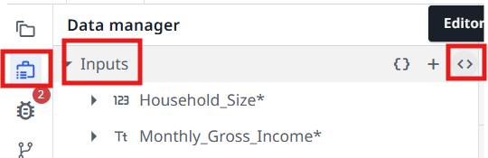{ .screenshot }
]]]

[[[
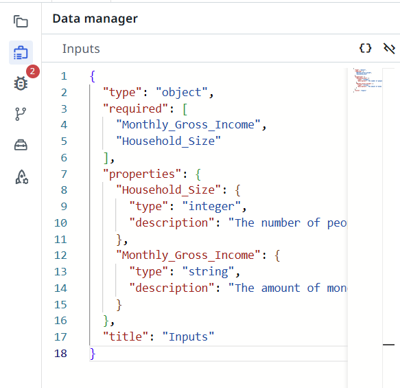{ .screenshot }
|50|
Paste this into the **input** schema editor.
]]]

??? note "Copy the input schema (JSON)"

    ```json
    {"type":"object","required":["Monthly_Gross_Income","Household_Size"],"properties":{"Household_Size":{"type":"integer","description":"The number of people living in the applicant's house"},"Monthly_Gross_Income":{"type":"string","description":"The amount of money the applicant's household makes in a month"}},"title":"Inputs"}
    ```

### 4. Set the output schema

[[[
**Output schema** — open the **output** schema editor.
|30|
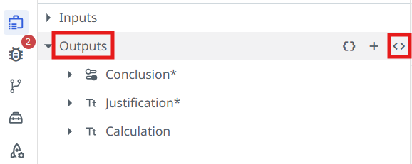{ .screenshot }
]]]

[[[
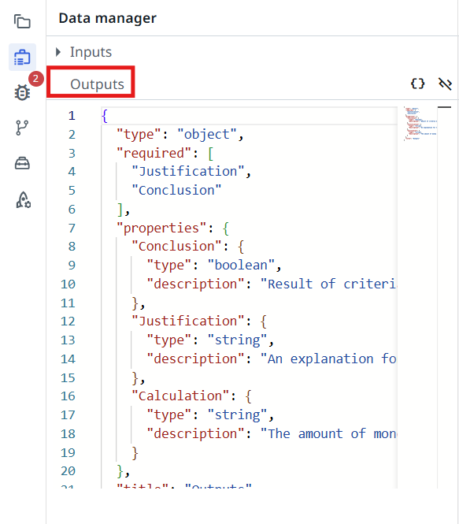{ .screenshot }
|50|
Paste this into the **output** schema editor.
]]]

??? note "Copy the output schema (JSON)"

    ```json
    {"type":"object","required":["Justification","Conclusion"],"properties":{"Conclusion":{"type":"boolean","description":"Result of criteria evaluation against provided context"},"Justification":{"type":"string","description":"An explanation for the conclusion, or of the inability to verify the criteria."},"Calculation":{"type":"number","description":"The amount of money the applicant is entitled to per month, if they are determined eligible for benefits."}},"title":"Outputs"}
    ```

## Context Grounding

[Context Grounding](https://docs.uipath.com/automation-cloud/automation-cloud/latest/admin-guide/about-context-grounding)
is a component of the UiPath AI Trust Layer which allows you to bring in your data to generate more
accurate, reliable GenAI predictions.

In this case, we are going to use context grounding to provide the agent with the Benefit Eligibility
criteria and calculation rules, to enable it to make the right decisions.

The **Eligibility Criteria** and **Benefit Calculation Rules** documents are indexed inside the
**Eligibility** context grounding index.

[[[
Benefit Calculation Rules.
|50|
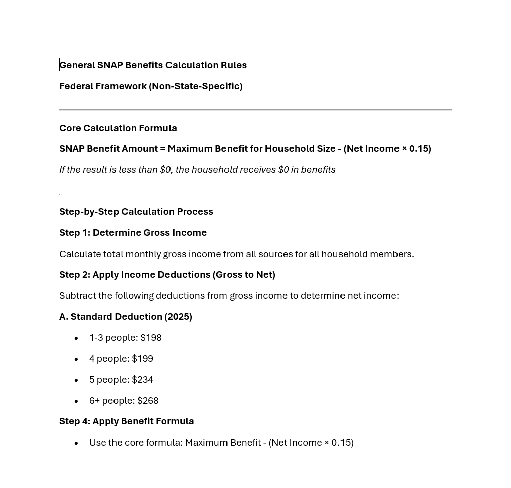{ .screenshot }
]]]

[[[
Eligibility Criteria.
|50|
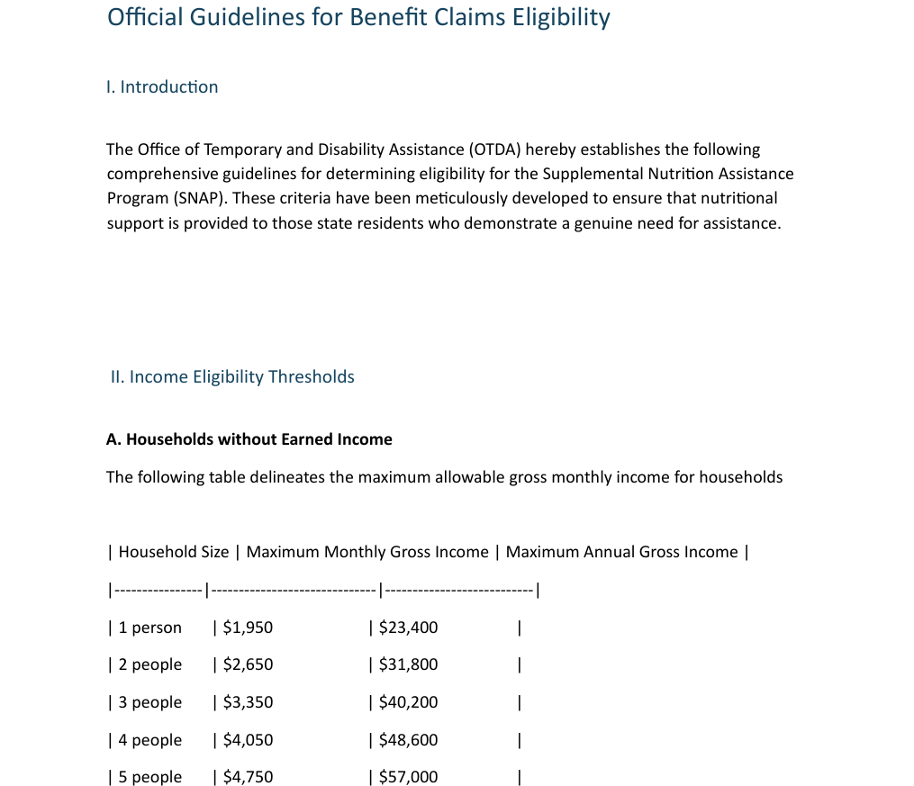{ .screenshot }
]]]

We are going to use the index named **Eligibility** (which is already created). Let's configure our
agent to use it.

### 5. Add the context to the agent

[[[
Click on the **Add Context** button.
|30|
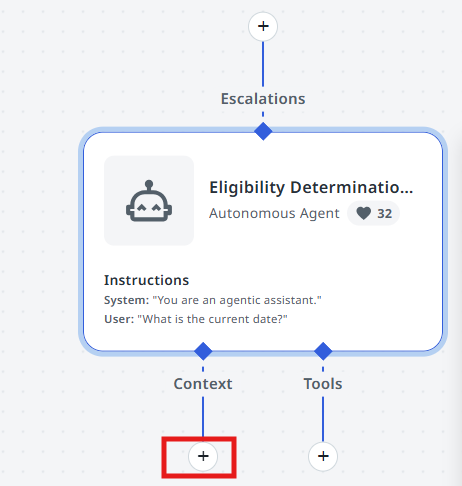{ .screenshot }
]]]

[[[
Select the **Eligibility** index from the current solution.
|30|
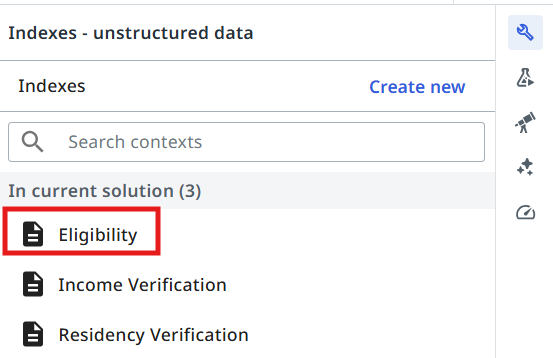{ .screenshot }
]]]

[[[
Select the **Semantic** search strategy.
|30|
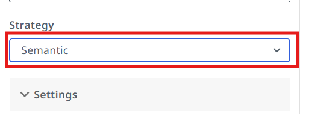{ .screenshot }
]]]

## Tools

Agent by itself is good at making decisions and analyzing data. But LLMs naturally can't go and
interact with databases and applications... yet. We are going to use
[tools](https://docs.uipath.com/agents/automation-cloud/latest/user-guide/agent-tools) for that. Tools
offer agents both access to critical context from data stored in business applications, and the ability
to execute actions based on objectives outlined in the prompt. Tools are how the agent's reasoning and
planning can turn into action.

There are various kind of tools we can configure for our agents:

- RPA Workflows
- Integration Service Activities
- Other Agents
- Specialized tools (example: **Analyze Files**)

Our agent needs to do arithmetic operations to determine the benefit amount for each applicant, so we
are going to use three RPA workflows as tools: **Addition Tool**, **Multiplication Tool** and
**Subtraction Tool**.

### 6. Add the three arithmetic tools

Let's add the tools to our agent. Here is an example of how to add the **Addition Tool**. The process
is similar for the other tools.

[[[
Click the **+** button from the tools section.
|30|
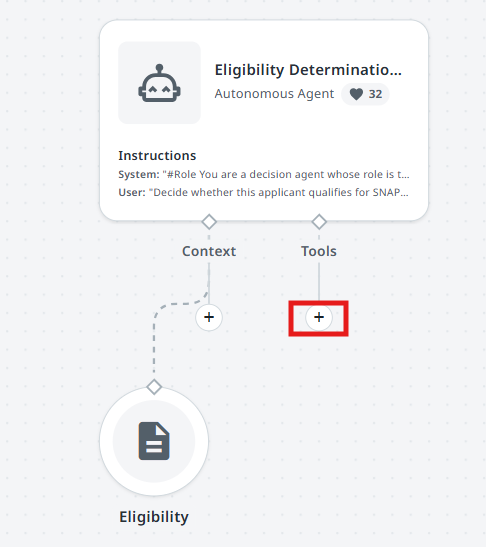{ .screenshot }
]]]

[[[
Search for the following tools and add them one by one:

- **Addition Tool**
- **Multiplication Tool**
- **Subtraction Tool**
|30|
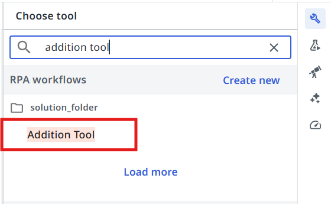{ .screenshot }
]]]

[[[
Add the following **descriptions** to each one of the tools — this helps the agent understand when to
use them:

- **Addition Tool** — Use this tool when you need to calculate a sum of two numbers
- **Multiplication Tool** — Use this tool when you need to multiply two numbers
- **Subtraction Tool** — Use this tool to calculate a subtraction between two numbers
|30|
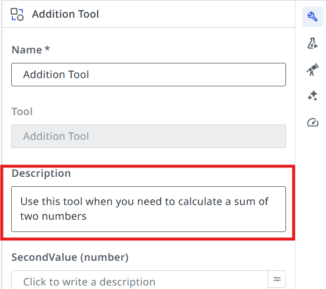{ .screenshot }
]]]

## Configuring Agent's Prompts

> Precision in prompts, like in coding, leads to powerful and predictable results. If your prompt is
> messy, expect messy output. Treat it like code, and write every word with purpose!
>
> — *another advice from gpt-4o*

{ width="260" }

First, let's understand the difference between **System prompt** and **User prompt**.

System Prompts provide consistent guidelines that define an agent's role and capabilities, while User
Prompts direct its attention to specific tasks and input parameters. Understanding this distinction is
essential for effectively designing and implementing AI agents that can perform complex tasks while
maintaining appropriate operational boundaries.

- **System prompt** — allows you to describe in natural language the agent's role, goal and constraints. You specify any rules for it to follow, and information about when it might want to use certain tools, escalations, or context – all of which we'll cover later in this guide.
- **User prompt** — User prompts allow you to structure how the inputs/arguments are passed to the agent, and you can also show in the user prompt how we'll refer to certain inputs in the system prompt.

### 7. Write the System Prompt

Let's start with the **System Prompt**. Copy the following and paste it into your **System Prompt**:

```text
#Role
You are a decision agent whose role is to evaluate if an applicant meets the eligibility criteria for Supplemental Nutrition Assistance Program (SNAP) benefits. The eligibility criteria is specified in the "Eligibility" context.
#Goals
Assess whether the given applicant information qualifies them for SNAP benefits. Output a conclusion along with an explanation for the decision. For qualified applicants, calculate the monthly benefit amount.
# Instructions
1. Determine the net income. Use the ##SNAP Eligibility## context to do this.
2. Determine if the applicant qualifies for benefits, according to the thresholds from the context.
- Set the Boolean value of ##Conclusion## to True if they qualify, or False if they don't.
3. Set the string value of ##Justification## to your explanation of the eligibility recommendation.
If they qualify for benefits:
 a. Calculate the maximum benefit amount for the household size.
 b. Set the value of ##Calculation## to the final benefit amount.
If they don't qualify for benefits:
 a. Set the value of ##Calculation## to "0".
##Calculation Rules
**DO NOT** make calculations directly, instead use the available tools (**Addition Tool**, **Subtraction Tool**, **Multiplication tool**) to make calculations.
```

### 8. Write the User Prompt

**User Prompt** connects it all together. In our case, the user prompt looks like this — paste it into
your **User Prompt**:

```text
Decide whether this applicant qualifies for SNAP benefits:
Household Size: {{Household_Size}}
Monthly Gross Income: {{Monthly_Gross_Income}}
```

### 9. Test the agent

Time to test it by giving it some sample inputs. Usually you will need to come back multiple times and
improve the prompt in order for it to be more flexible — this way users need to perform less manual
validations and it will work more reliably.

Let's test the following scenarios.

=== "Qualifies — household of 4"

    ```text
    Household_Size: 4
    Monthly_Gross_Income: 2500
    ```

    According to the guidelines, the applicant qualifies for benefits, because the maximum allowed
    gross income for a household of 4 is $4,050.

    Output should be **Conclusion: True**, **Calculation: 649.85**

=== "Does not qualify — household of 1"

    ```text
    Household_Size: 1
    Monthly_Gross_Income: 2000
    ```

    According to the guidelines, the applicant does not qualify for benefits, because the maximum
    allowed gross income for a household of 1 is $1,950, which is exceeded by the applicant's gross
    income.

    Output should be **Conclusion: False**, **Calculation: 0**

## Quality Control and Evaluations

How about giving our agent a thorough testing?

- Imagine that tomorrow a brand new model is released, or for some reason, for example cost, you would like to switch to an alternative LLM. How would you ensure that this change will not disrupt agent's result?
- What if during numerous improvements and fine tuning of prompt previous document samples do not work anymore?

The solution is in automated testing, just like we do with Robots, or pretty much any other source
code. Let's build Evaluations that help us with automatic validation of results for a set of predefined
samples.

An [evaluation](https://docs.uipath.com/agents/automation-cloud/latest/user-guide/agent-evaluations) is
a pair between an input and an assertion — or evaluator — made on the output. The evaluator is a
defined condition or rule used to assess whether the agent's output meets the expected output or
expected trajectory.

There are three main categories of evaluators:

**LLM-as-a-Judge:**

- Recommended as the default approach when targeting the root output.
- Provides flexible evaluation of complex outputs.
- Best used when evaluating reasoning, natural language responses, or complex structured outputs.

**Deterministic**

- Recommended when expecting exact matches.
- Most effective when output requirements are strictly defined
- Works with complex objects, but is best used with:
    - Boolean responses (true/false)
    - Specific numerical values
    - Exact string matches
    - Array of primitives

**Trajectory**

- Used to judge the agent's overall behavior based on its run history and expected behavior.

Our Agent has the following output fields:

- **Conclusion** — "true" or "false" — **deterministic output**
- **Calculation** — the benefit amount that the applicant qualifies for — **deterministic output**
- **Justification** — An explanation for the conclusion and calculation made by the agent — **dynamic output**

Let's assume we want to test the **Conclusion** and **Calculation** output fields. To do that, we will
use a deterministic evaluator.

### 10. Create the two evaluators

Go to **Evaluators** and click **Create New**.

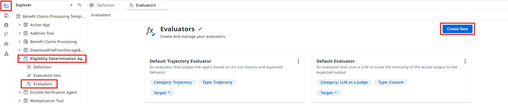{ .screenshot width="900" }

[[[
Select **Exact match** evaluator type.
|50|
{ .screenshot }
]]]

[[[
Let's give our evaluator a name:

```text
Conclusion Evaluator
```

The target output field will be **Conclusion**.
|50|
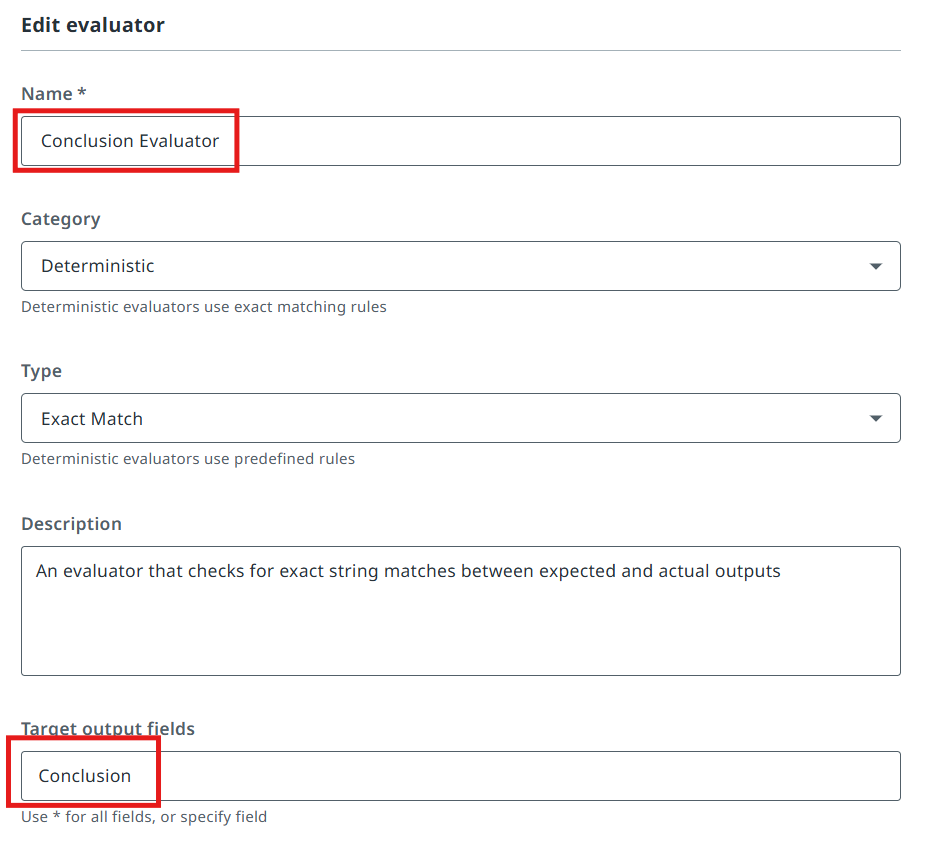{ .screenshot }
]]]

[[[
Let's create one more evaluator, for the **Calculation** field:

```text
Calculation Evaluator
```

The target output field will be **Calculation**.
|50|
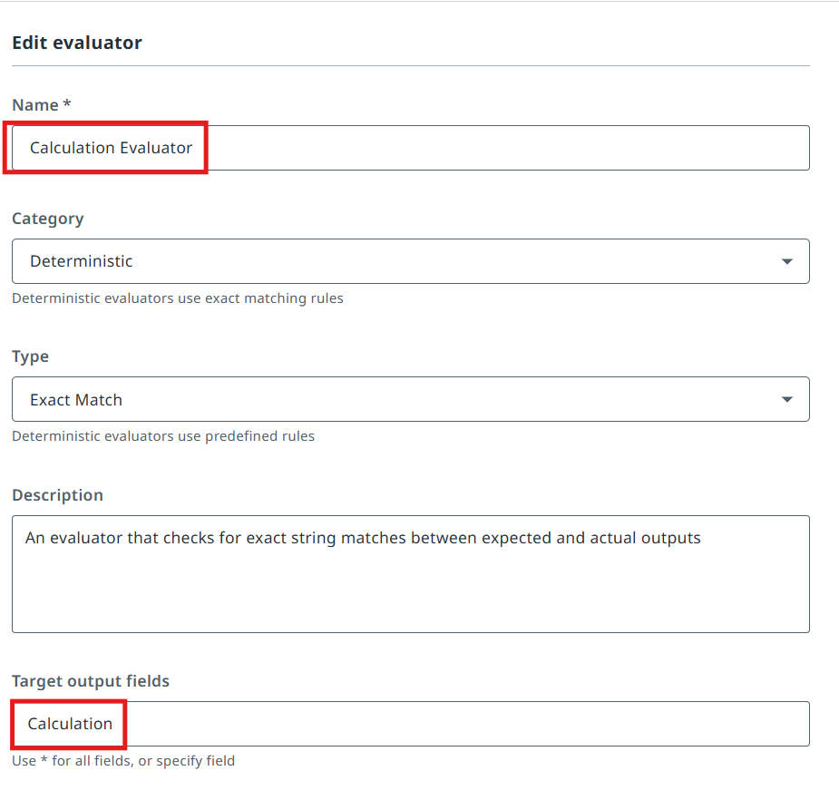{ .screenshot }
]]]

### 11. Import the evaluation set

Let's now import an evaluation set to test our agent.

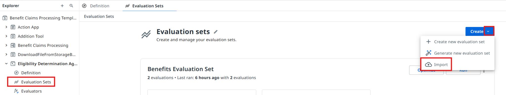{ .screenshot width="900" }

??? note "Copy this evaluation set (JSON)"

    ```json
    {"fileName":"evaluation-set-1775476242050.json","id":"2d54e8b6-869e-4418-a91a-b63726b44b44","name":"Benefits Evaluation Set (copy)","batchSize":10,"evaluatorRefs":["aa6d3e4d-c78a-4390-a504-14ffdaba4077","d5b4fec5-0f00-42e2-8ea7-2a0d911aacf8"],"evaluations":[{"id":"c22a8498-4168-4605-b0e2-b58d023e229b","name":"Qualify_1","inputs":{"Household_Size":1,"Monthly_Gross_Income":"1200"},"expectedOutput":{"Conclusion":true,"Justification":"-","Calculation":149.7},"simulationInstructions":"","expectedAgentBehavior":"","simulateInput":false,"inputGenerationInstructions":"","simulateTools":false,"toolsToSimulate":[],"evalSetId":"ee9e5a82-247e-43d2-a407-b50dcd2ac38d","createdAt":"2026-04-06T11:50:42.050Z","updatedAt":"2026-04-06T11:50:42.050Z","source":"manual"},{"id":"78c0a0a3-f7d9-4ff8-a858-8daded052879","name":"Qualify_2","inputs":{"Household_Size":4,"Monthly_Gross_Income":"2500"},"expectedOutput":{"Conclusion":true,"Justification":"-","Calculation":649.85},"simulationInstructions":"","expectedAgentBehavior":"","simulateInput":false,"inputGenerationInstructions":"","simulateTools":false,"toolsToSimulate":[],"evalSetId":"ee9e5a82-247e-43d2-a407-b50dcd2ac38d","createdAt":"2026-04-06T11:50:42.050Z","updatedAt":"2026-04-06T11:50:42.050Z","source":"manual"},{"id":"65566054-7730-40bb-93fd-71dba2a3a6d9","name":"Qualify_3","inputs":{"Household_Size":3,"Monthly_Gross_Income":"800"},"expectedOutput":{"Conclusion":true,"Justification":"-","Calculation":694.7},"simulationInstructions":"","expectedAgentBehavior":"","simulateInput":false,"inputGenerationInstructions":"","simulateTools":false,"toolsToSimulate":[],"evalSetId":"ee9e5a82-247e-43d2-a407-b50dcd2ac38d","createdAt":"2026-04-06T11:50:42.050Z","updatedAt":"2026-04-06T11:50:42.050Z","source":"manual"},{"id":"d667febc-6e86-4c88-8b38-1fa139aeaf73","name":"Qualify_5","inputs":{"Household_Size":6,"Monthly_Gross_Income":"4000"},"expectedOutput":{"Conclusion":true,"Justification":"-","Calculation":855.2},"simulationInstructions":"","expectedAgentBehavior":"","simulateInput":false,"inputGenerationInstructions":"","simulateTools":false,"toolsToSimulate":[],"evalSetId":"ee9e5a82-247e-43d2-a407-b50dcd2ac38d","createdAt":"2026-04-06T11:50:42.050Z","updatedAt":"2026-04-06T11:50:42.050Z","source":"manual"},{"id":"65a7f339-a4bf-4edb-bc60-cfcbcd3fad98","name":"Not_Qualify_1","inputs":{"Household_Size":1,"Monthly_Gross_Income":"2000"},"expectedOutput":{"Conclusion":false,"Justification":"-","Calculation":0},"simulationInstructions":"","expectedAgentBehavior":"","simulateInput":false,"inputGenerationInstructions":"","simulateTools":false,"toolsToSimulate":[],"evalSetId":"ee9e5a82-247e-43d2-a407-b50dcd2ac38d","createdAt":"2026-04-06T11:50:42.050Z","updatedAt":"2026-04-06T11:50:42.050Z","source":"manual"},{"id":"481d251c-83b1-4368-9671-aceaab47450c","name":"Not_Qualify_2","inputs":{"Household_Size":4,"Monthly_Gross_Income":"4100"},"expectedOutput":{"Conclusion":false,"Justification":"-","Calculation":0},"simulationInstructions":"","expectedAgentBehavior":"","simulateInput":false,"inputGenerationInstructions":"","simulateTools":false,"toolsToSimulate":[],"evalSetId":"ee9e5a82-247e-43d2-a407-b50dcd2ac38d","createdAt":"2026-04-06T11:50:42.050Z","updatedAt":"2026-04-06T11:50:42.050Z","source":"manual"},{"id":"0681214b-efb9-4971-86d3-a17f6f24ee18","name":"Not_Qualify_3","inputs":{"Household_Size":5,"Monthly_Gross_Income":"5500"},"expectedOutput":{"Conclusion":false,"Justification":"-","Calculation":0},"simulationInstructions":"","expectedAgentBehavior":"","simulateInput":false,"inputGenerationInstructions":"","simulateTools":false,"toolsToSimulate":[],"evalSetId":"ee9e5a82-247e-43d2-a407-b50dcd2ac38d","createdAt":"2026-04-06T11:50:42.050Z","updatedAt":"2026-04-06T11:50:42.050Z","source":"manual"},{"id":"b14b78c6-9b13-4414-9859-d2f483b69f6d","name":"Not_Qualify_4","inputs":{"Household_Size":2,"Monthly_Gross_Income":"2700"},"expectedOutput":{"Conclusion":false,"Justification":"-","Calculation":0},"simulationInstructions":"","expectedAgentBehavior":"","simulateInput":false,"inputGenerationInstructions":"","simulateTools":false,"toolsToSimulate":[],"evalSetId":"ee9e5a82-247e-43d2-a407-b50dcd2ac38d","createdAt":"2026-04-06T11:50:42.050Z","updatedAt":"2026-04-06T11:50:42.050Z","source":"manual"},{"id":"90cd2c2b-9e66-4e41-89fa-206521b7f1de","name":"Not_Qualify_5","inputs":{"Household_Size":3,"Monthly_Gross_Income":"3500"},"expectedOutput":{"Conclusion":false,"Justification":"-","Calculation":0},"simulationInstructions":"","expectedAgentBehavior":"","simulateInput":false,"inputGenerationInstructions":"","simulateTools":false,"toolsToSimulate":[],"evalSetId":"ee9e5a82-247e-43d2-a407-b50dcd2ac38d","createdAt":"2026-04-06T11:50:42.050Z","updatedAt":"2026-04-06T11:50:42.050Z","source":"manual"}],"modelSettings":[],"createdAt":"2026-04-06T11:50:42.050Z","updatedAt":"2026-04-06T17:45:34.085Z","agentMemoryEnabled":false,"agentMemorySettings":[],"lineByLineEvaluation":false}
    ```

[[[
Paste it into the import window. After that click the **Import** button.
|50|
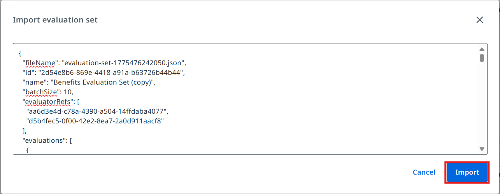{ .screenshot }
]]]

[[[
Open the evaluation set and select the **Conclusion Evaluator** and **Calculation Evaluator** that we
configured earlier.
|50|
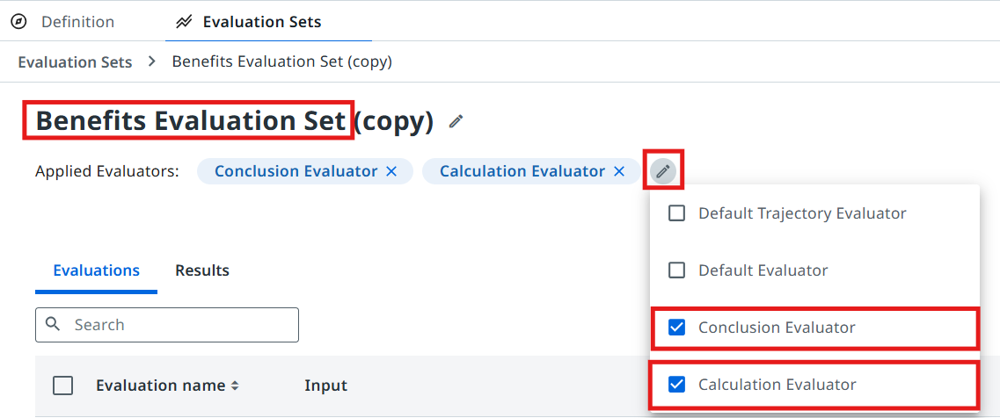{ .screenshot }
]]]

[[[
Evaluate the set and discuss the results with the trainer.
|30|
{ .screenshot }
]]]

## Configuring the Agentic Task in Maestro

Let's get back to Studio and continue editing our Agentic Process.

### 12. Point the task at your agent

[[[
Configure the **Eligibility Determination** task to use our freshly prepared AI Agent! This is done in
the same way as the Robotic task: pick **Start and wait for agent**, then search for the agent in your
solution.
|50|
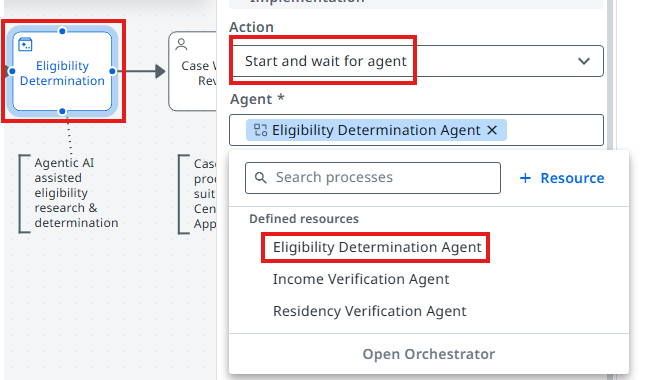{ .screenshot }
]]]

### 13. Map the inputs

[[[
Now we need to pick outputs from the **Process Benefits Application** RPA Task, and add them as inputs
to the Agent — here is how you do it in your Agentic task's **Settings**.
|30|
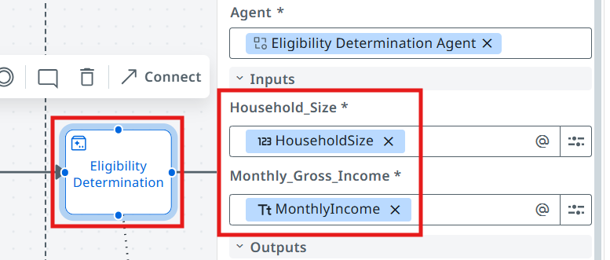{ .screenshot }
]]]

In the end:

- Robot's **HouseHoldSize** should map into Agent's **Household_Size**
- Robot's **MonthlyIncome** should map into Agent's **Monthly_Gross_Income**

### 14. Run it

Process is ready for testing — click on the **Debug** button! This time we can check the output of the
**Eligibility Determination Agent**.

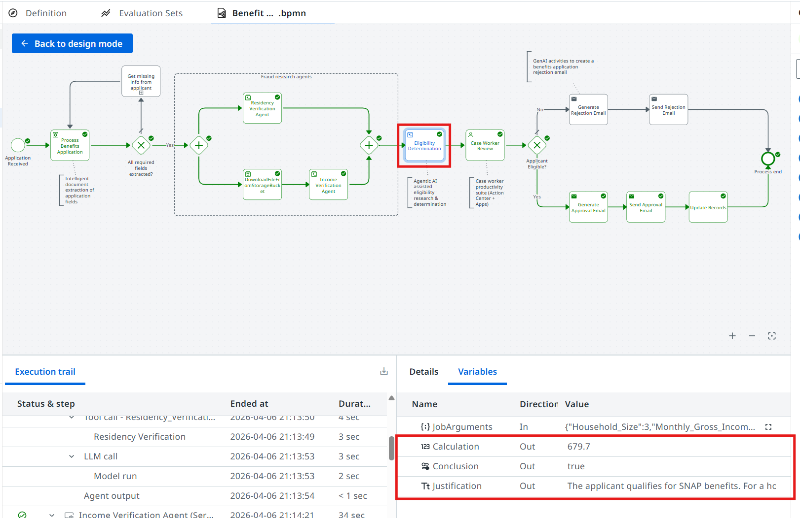{ .screenshot width="900" }

**Time to move to the next one!**
