# Add an Action App for human validation

!!! tip "Here is our plan for this lesson:"

    1. Add a validation Action App to our project
    2. Configure the process flow for humans to review the documents submitted by the applicant and the decisions made by the agents
    3. Based on the App Action, direct the flow further

## Goal

In many cases where an Agent can not determine the exact course of action, or when double checking is
necessary, human involvement is required. Humans process tasks in **Action Center** using the
conveniently summarized inputs from Robots and Agents.

## Involving humans only when necessary

- all inputs required to make a decision should be presented on one screen: ideally we don't want business users to open applications or go back and review execution flow.
- agent's and robot's job is to prepare all inputs in the right format, so that when time comes to ask user inputs, it's ready.
- once a decision is made — our Process execution continues to next steps.

[[[
Let's plan the Action's structure.

In short, we need a nice frontend for the user, where the agent decisions along with necessary
information is presented to make a decision.
|30|
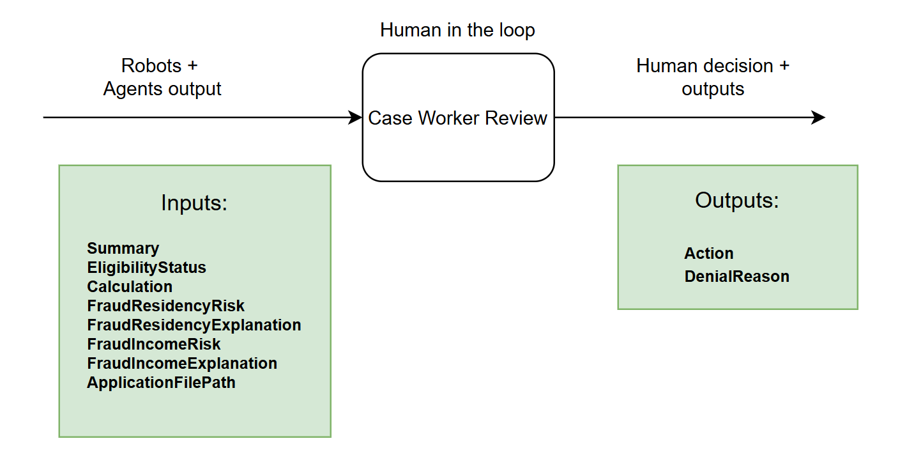{ .screenshot }
]]]

Do you think this kind of form will be helpful for a business user to speed up processing time? Any
opportunity to improve it?

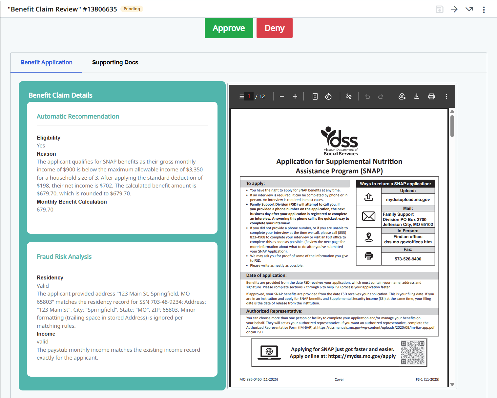{ .screenshot width="900" }

Let's build it!!! Well… it will take a lot of time, so… maybe let's just take a look at the already
built app and discuss it.

## Steps

### 1. Review the Action App

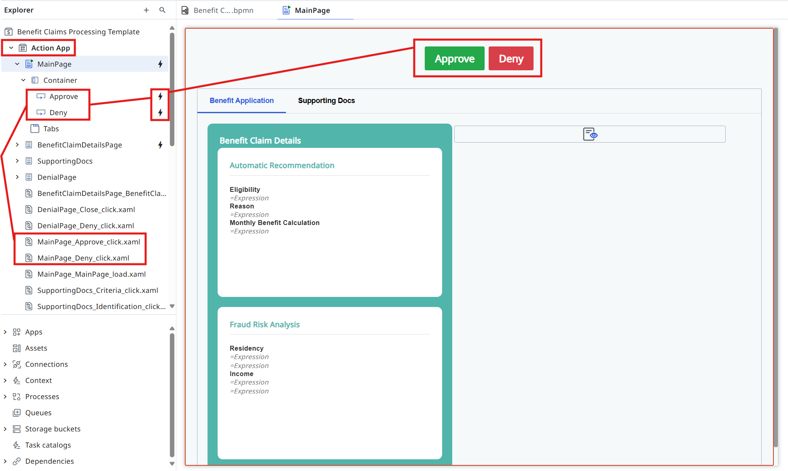{ .screenshot width="900" }

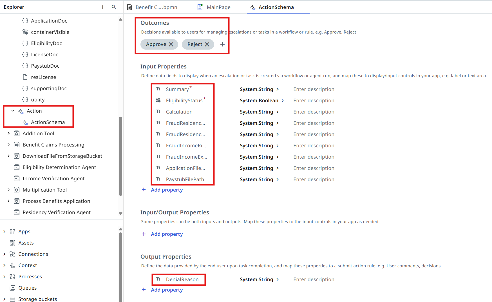{ .screenshot width="900" }

### 2. Add the human validation task

[[[
Let's open the Agentic Process again and configure the validation task as an **Action App Task**.
|30|
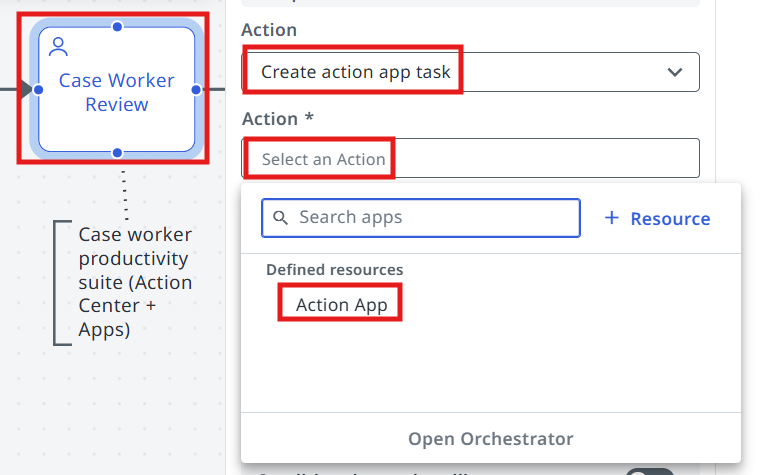{ .screenshot }
]]]

[[[
Pick the Action App for the task.
|30|
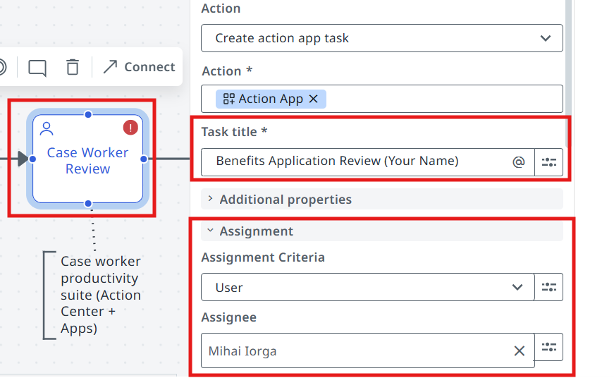{ .screenshot }
]]]

[[[
- Make sure to **customize your Task Title**, so that it's easier to identify our tasks in Action Center later.
- In the Assignment section, **assign the task to yourself**. Otherwise you will need to locate the task in a pool of all unassigned tasks.
|50|
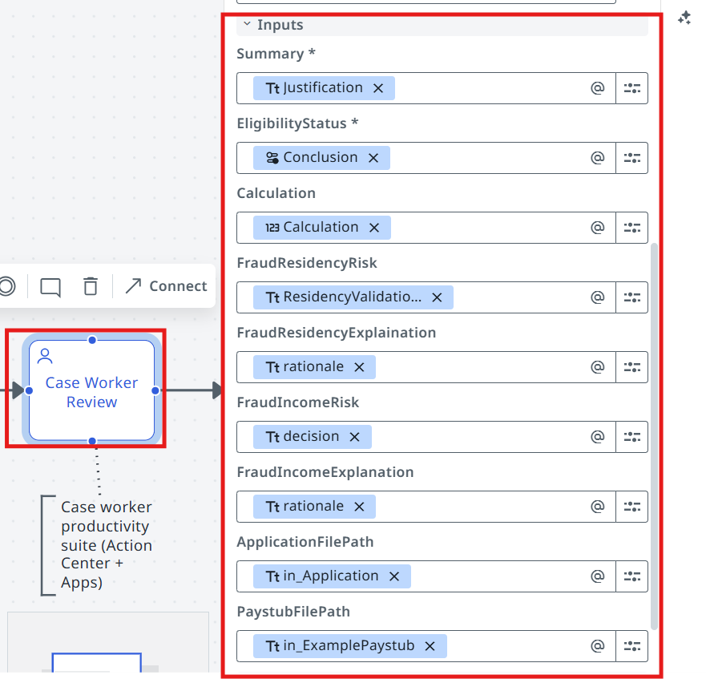{ .screenshot }
]]]

### 3. Pass the inputs to the Action App

Let's pass the following inputs to the action app:

| Action App input | Mapped from |
| :--- | :--- |
| **Summary** | Justification *(Eligibility Determination Agent)* |
| **EligibilityStatus** | Conclusion *(Eligibility Determination Agent)* |
| **Calculation** | Calculation *(Eligibility Determination Agent)* |
| **FraudResidencyRisk** | ResidencyValidationDecision *(Residency Verification Agent)* |
| **FraudResidencyExplanation** | rationale *(Residency Verification Agent)* |
| **FraudIncomeRisk** | decision *(Income Verification Agent)* |
| **FraudIncomeExplanation** | rationale *(Income Verification Agent)* |
| **ApplicationFilePath** | in_Application *(input arguments)* |
| **PaystubFilePath** | in_ExamplePaystub *(input arguments)* |

### 4. Configure the Exclusive Gateway decision

One last step in this lesson — let's configure the downstream flow based on the validation decision.

[[[
Open the gateway that follows the Case Worker Review task.
|50|
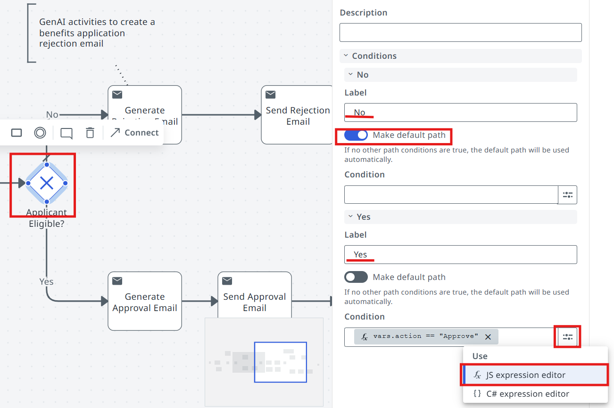{ .screenshot }
]]]

[[[
Let's **set "No" as the default path** (noting that a real business process might have a different
approach).

Then in the Expression Editor pick the **Action** output, which as per App settings can be
`Approve` or `Reject`.
|50|
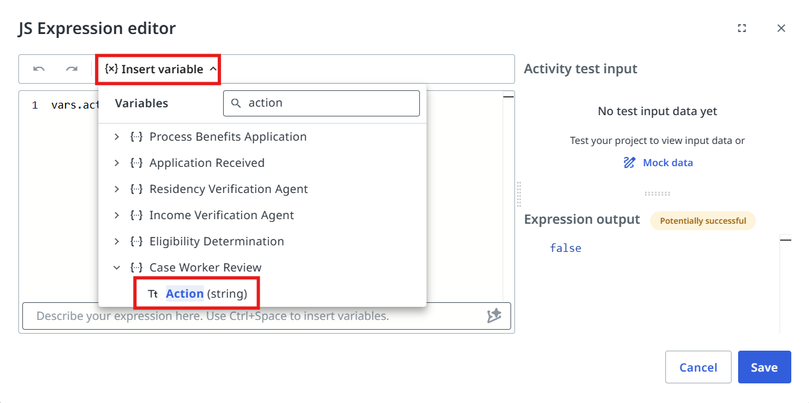{ .screenshot }
]]]

[[[
Here is what we want for the **Yes** path:

```js
vars.action == "Approve"
```
|30|
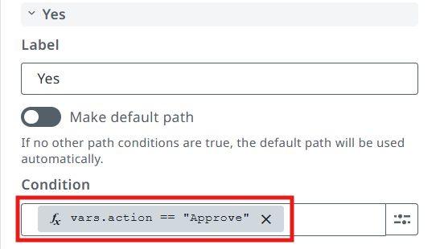{ .screenshot }
]]]

### 5. Test it

Testing time! Now click on the **Debug** button and monitor the execution.

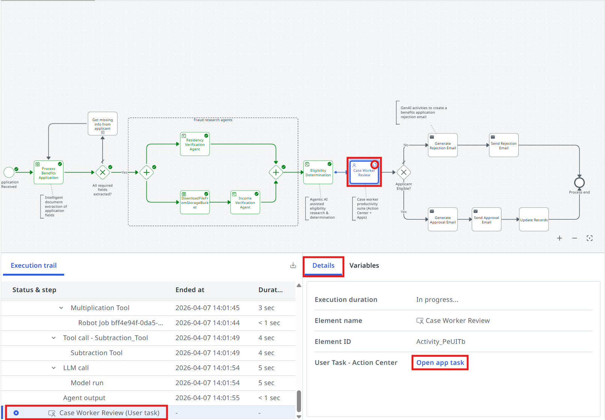{ .screenshot width="900" }

Processing stopped until a decision is made. Click the **Open app task** link or find the task in
**Action Center**:

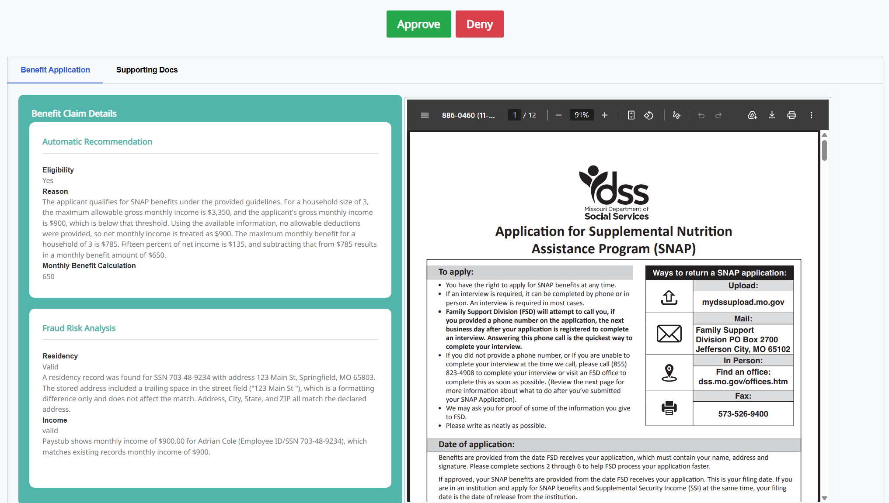{ .screenshot width="900" }

[[[
As soon as the task is processed, Maestro continues the execution. In this case the outcome was
**Deny**:
|50|
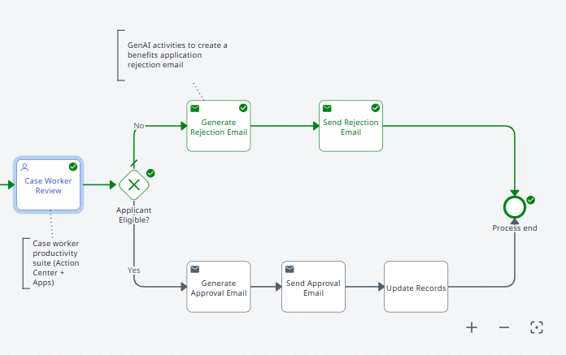{ .screenshot }
]]]

**Time to move to the next one!**
