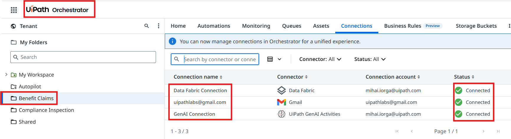
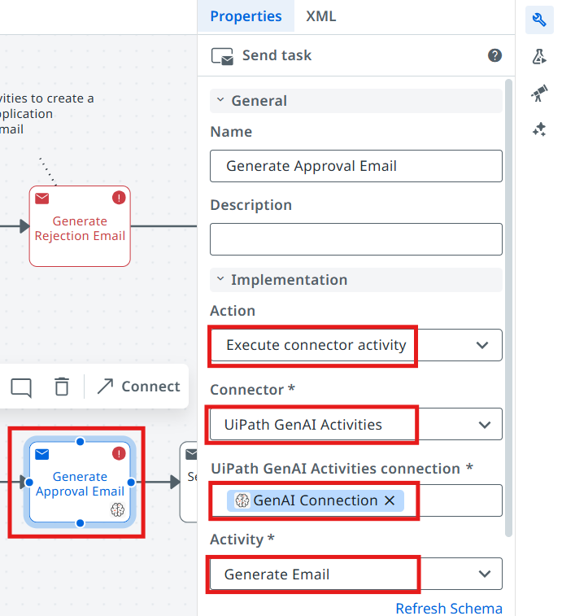
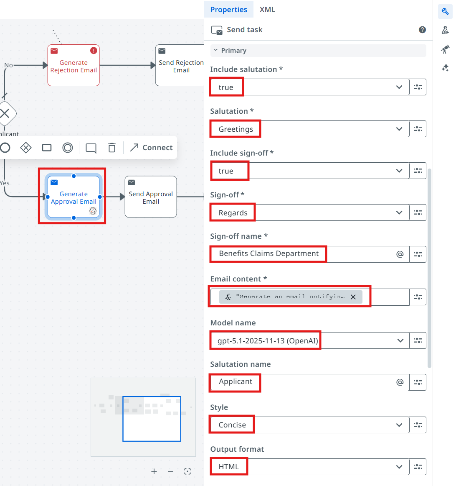
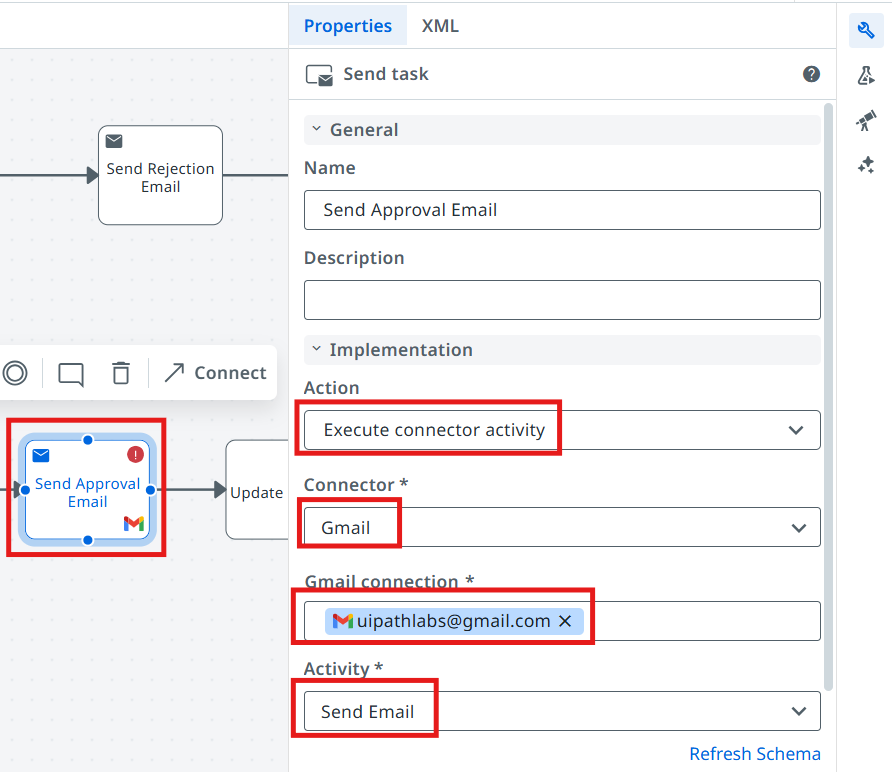
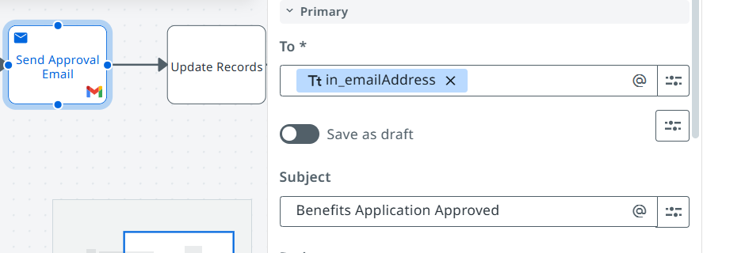
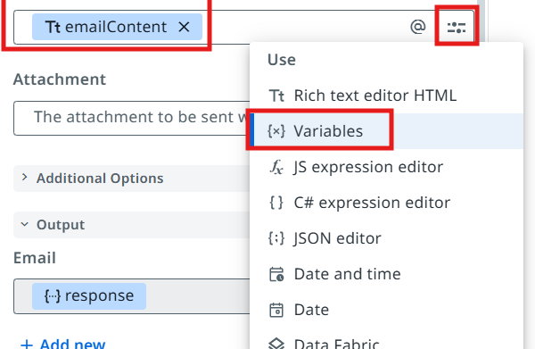
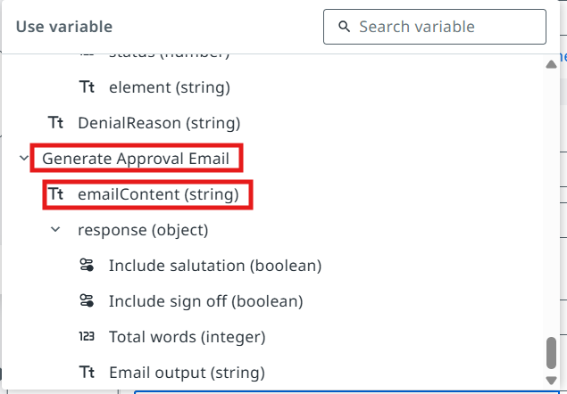
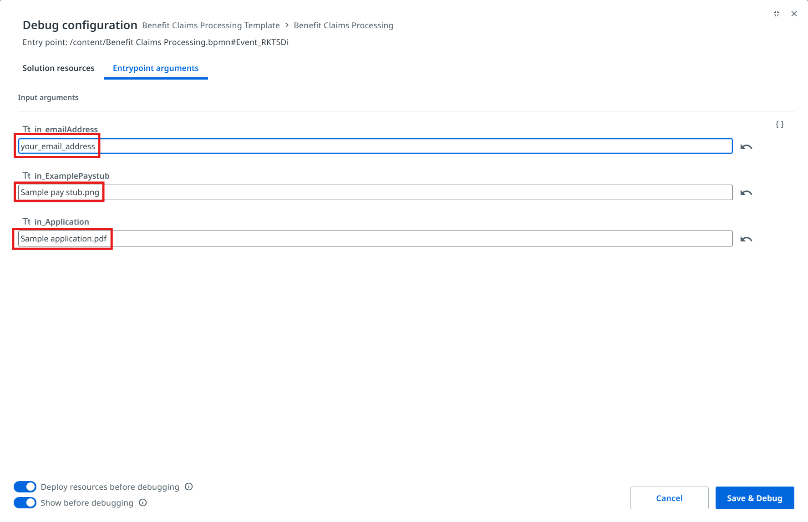
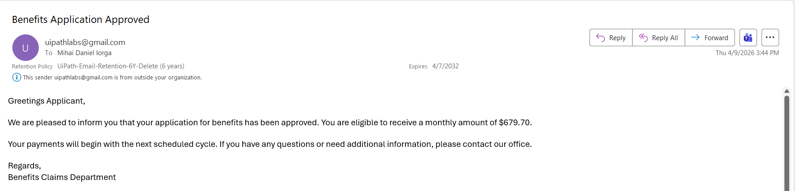

# Update external systems using API — Benefit Approval Case

!!! tip "Here is our plan for this lesson:"

    1. Generate a benefits approval email using Gen AI
    2. Send the email to the benefits applicant, using an **Integration Service** Gmail connector

## Goal

Let's configure the tasks in the workflow accordingly, so that the applicant is notified once the case
worker has approved the claim.

## Integration Service

**UiPath** [Integration Service](https://docs.uipath.com/integration-service/automation-cloud/latest/user-guide/introduction)
is the fastest and most convenient way to automate API enabled applications. It takes care of
authorization and authentication, helping you centralize management of API connections and also
allowing faster integration into SaaS platforms.

Let's see what we have prepared:

{ .screenshot width="900" }

There are 3 connections available:

- **Gmail Connection** that we can use to send emails
- **Data Fabric Connection** where we can store any type of data (tables, files, etc.)
- **GenAI Connection** which we will use to generate emails using LLMs

Good part: we don't need to worry about credentials or permissions today — platform administrators have
prepared these for our automation, and they are also taking care about securing and restricting access
to these.

!!! warning "Check your tenant"
    Make sure you are using the right tenant, or contact your trainer if there are issues with
    connections.

## Steps

### 1. Configure the Generate Approval Email task

Let's configure the **Generate Approval Email** task in Maestro. For this, we are going to use the
[UiPath GenAI Activities](https://docs.uipath.com/activities/other/latest/integration-service/uipath-uipath-airdk-about) —
specifically the
[Generate Email](https://docs.uipath.com/activities/other/latest/integration-service/uipath-airdk-airdk-generate-email)
activity.

[[[
- Action will be **Execute Connector Activity**
- Pick the UiPath GenAI Activities connector and configure the **GenAI Connection**
- Select the **Generate Email** activity
|50|
{ .screenshot }
]]]

[[[
{ .screenshot }
|50|
Next, let's configure the input properties listed below.
]]]

| Property | Value |
| :--- | :--- |
| Include salutation | **true** |
| Salutation | **Greetings** |
| Include sign-off | **true** |
| Sign-off | **Regards** |
| Sign-off name | **Benefits Claims Department** |
| Model | **gpt-5.1** |
| Salutation name | **Applicant** |
| Style | **Concise** |
| Output format | **HTML** |

Email content — enter this as a **JS Expression**:

```js
"Generate an email notifying the recipient that their application for benefits has been approved. Monthly ammount: "+vars.calculation+" $."
```

!!! note "Model name in the dropdown"
    The **Model** dropdown lists the full model id — in the screenshots it appears as
    `gpt-5.1-2025-11-13 (OpenAI)`.

### 2. Configure the Send Approval Email task

Once we have the generated email, we can send it to the applicant using the Gmail connector. Let's
configure the **Send Approval Email** task.

[[[
- Action will be **Execute Connector Activity**
- Pick the **Gmail Connector** and select the `uipathlabs@gmail.com` connection
- Pick the **Send Email** activity
|30|
{ .screenshot }
]]]

[[[
The Gmail activity with its connection configured.
|30|
{ .screenshot }
]]]

### 3. Configure the activity properties

[[[
- **To** — we are going to use the **in_EmailAddress** argument from the start event
- **Subject**:

```text
Benefits Application approved
```

- **Body** — the **emailContent** output variable from the **Generate Approval Email** task
|50|
{ .screenshot }
]]]

[[[
Pick the **emailContent** variable for the Body field.
|50|
{ .screenshot }
]]]

### 4. Test the approval scenario

Time to test the approval scenario! Configure the debug values of the BPMN process as in the picture
below. In the **Case Worker Review** action center task, **approve** the benefits application.

In the debug panel, pass the following argument values:

```text
in_emailAddress:   your own email address
in_ExamplePaystub: Sample pay stub.png
in_Application:    Sample application.pdf
```

{ .screenshot width="900" }

Once the execution of the process is completed, you should receive the benefits approval email:

{ .screenshot width="900" }

**Time to move to the next one!**
